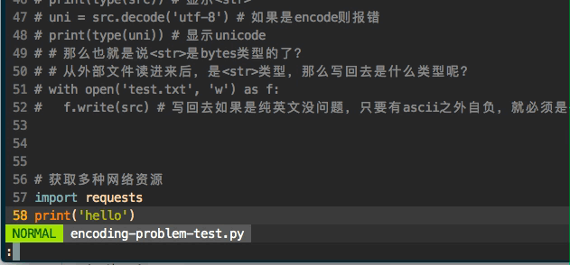

#  ❖ Vim自动运行（或编译运行）文件

不像SublimeRepl需要安装插件，Vim原生支持直接运行python等代码。只要输入命令：
`:!python %`
其它语言代码类似。
输入命令后，vim界面会暂时跳出编辑页面跳到终端页面显示执行过程，期间可以按任意键返回vim编辑页面。
输过一次后，就可以用`:!!`直接重复上次的命令，不用再输一遍命令。


为了更方便，我们还可以设置`autocmd`让VIM根据不同的代码类型执行不同的编译命令。

以下案例中，我们设置`Ctrl-m`为执行触发键：
```vim
"<Builds/Compiles>----{
    " Get current filetype -> :echo &filetype or as variable &filetype
    " [ Builds / Compiles / Interpretes  ]
    "<C/C++ Compiler>  -> Compile & run
        autocmd BufReadPre *.c noremap <buffer> <C-m> :w<CR>:!gcc % && ./a.out <CR>
        autocmd BufReadPre *.cpp noremap <buffer> <C-m> :w<CR>:!g++ % && ./a.out <CR>

    "<Python Interpreter>
        autocmd BufReadPre *.py noremap <buffer> <C-m> :w<CR>:!python %:p <CR>
        "autocmd BufReadPre *.py noremap <buffer> K yiw:!pydoc <C-r>0<CR>
    "<Bash Script>
        autocmd BufReadPre *.sh noremap <buffer> <C-m> :w<CR>:!bash % <CR>

    "<RCs> (Configs)
        autocmd BufReadPre .vimrc,vimrc* noremap <buffer> <C-m> :w<CR>:source % <CR>
        autocmd BufReadPre .zshrc,zshrc* noremap <buffer> <C-m> :w<CR>:!source % <CR>

    "<Executable>  -> conflict with above
    ""noremap <buffer> <C-u> :!./% <CR>
    ""noremap <buffer> <C-u> :! %:p <CR>

    ">Use FileType group
    "autocmd FileType vim,tmux noremap <buffer> <C-u> :w<CR><ESC>:source % <CR>
    "autocmd FileType zsh noremap <buffer> <C-u> :w<CR>:!source % <CR>
    "autocmd FileType sh noremap <buffer> <C-u> :w<CR>:!bash % <CR>
    "autocmd FileType python noremap <buffer> <C-u> :w<CR>:!python % <CR>
    "autocmd FileType c noremap <buffer> <C-u> :w<CR>:!gcc % && ./a.out <CR>
    "autocmd FileType cpp noremap <buffer> <C-u> :w<CR>:!g++ % && ./a.out <CR>
" }
```
