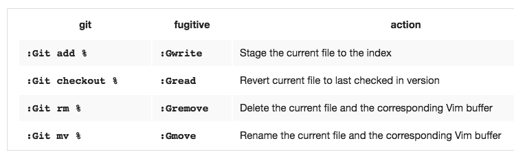

# Vim 的Git插件 - `Fugitive`
在vim里面操作，总是切换出去用git命令提交，一开始学习阶段还好，但是慢慢也烦了，就找到了这款最通用的插件，而且是Vundle管理器的默认搭配插件。
[参考文章](http://vimcasts.org/episodes/fugitive-vim---a-complement-to-command-line-git/)。
常用命令如下：

