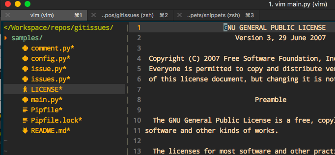
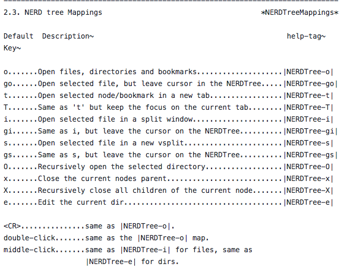

#  ❖ Vim的NerdTree插件


> 一个项目文件多起来时，左边的文件树菜单是必要的。

[参考：常用文件树快捷键](https://yang3wei.github.io/blog/2013/01/29/nerdtree-kuai-jie-jian-ji-lu/)
[所有命令及推荐键盘映射：官方](https://github.com/scrooloose/nerdtree/blob/master/doc/NERDTree.txt)



在vundle插件管理的方式，直接在`~/.vimrc`中的Plugin段落中加入`Plugin "scrooloose/nerdtree
"`然后重启Vim并输入`PluginInstall`，即可完成安装

然后输入`: NERDTreeToggle`即可打开文件树。当然，默认是关闭的，需要每次都输入命令打开。
还可以设置vim快捷键来映射,在vimrc中加入：
```
map <F3> :NERDTreeMirror<CR>
map <F3> :NERDTreeToggle<CR>
```


## 切换工作台和目录
```
ctrl + w + h    光标 focus 左侧树形目录
ctrl + w + l    光标 focus 右侧文件显示窗口
ctrl + w + w    光标自动在左右侧窗口切换
ctrl + w + r    移动当前窗口的布局位置

o       在已有窗口中打开文件、目录或书签，并跳到该窗口
go      在已有窗口 中打开文件、目录或书签，但不跳到该窗口
t       在新 Tab 中打开选中文件/书签，并跳到新 Tab
T       在新 Tab 中打开选中文件/书签，但不跳到新 Tab
i       split 一个新窗口打开选中文件，并跳到该窗口
gi      split 一个新窗口打开选中文件，但不跳到该窗口
s       vsplit 一个新窗口打开选中文件，并跳到该窗口
gs      vsplit 一个新 窗口打开选中文件，但不跳到该窗口
!       执行当前文件
O       递归打开选中 结点下的所有目录
m    文件操作：复制、删除、移动等
```

## 切换标签页
```
:tabnew [++opt选项] ［＋cmd］ 文件      建立对指定文件新的tab
:tabc   关闭当前的 tab
:tabo   关闭所有其他的 tab
:tabs   查看所有打开的 tab
:tabp   前一个 tab
:tabn   后一个 tab

标准模式下：
gT      前一个 tab
gt      后一个 tab
```

### 刚开始使用时候的小问题
目前问题是，不能保存所有打开文件的状态。在同一个tab中打开另一个文件时，之前文件的编辑历史都会丢失，也就是没法`u`撤销编辑。即使有相关的方法控制这些，只是作为一个文件菜单来说，这也太麻烦了。
解决方案：
文件都在新tab打开，这样就可以保持各自状态了。

## 常用键盘映射




## NerdTree 在 .vimrc 中的常用配置
```
autocmd vimenter * NERDTree  "自动开启Nerdtree
"let g:NERDTreeWinSize = 25 "设定 NERDTree 视窗大小
"开启/关闭nerdtree快捷键
map <C-f> :NERDTreeToggle<CR>
"let NERDTreeShowBookmarks=1  " 开启Nerdtree时自动显示Bookmarks
"打开vim时如果没有文件自动打开NERDTree
autocmd vimenter * if !argc()|NERDTree|endif
"当NERDTree为剩下的唯一窗口时自动关闭
autocmd bufenter * if (winnr("$") == 1 && exists("b:NERDTree") && b:NERDTree.isTabTree()) | q | endif
"设置树的显示图标
let g:NERDTreeDirArrowExpandable = '▸'
let g:NERDTreeDirArrowCollapsible = '▾'
let NERDTreeIgnore = ['\.pyc$']  " 过滤所有.pyc文件不显示
"let g:NERDTreeShowLineNumbers=1  " 是否显示行号
let g:NERDTreeHidden=0     "不显示隐藏文件
"Making it prettier
let NERDTreeMinimalUI = 1
let NERDTreeDirArrows = 1
```

## Nerdtree隐藏某些指定文件
Vim经常产生swp缓存文件，还有一些python产生的pyc文件，Nerdtree显示出来很不好看，最好屏蔽掉。
在vimrc中配置这几句话可以达到效果：
```vim
" 不显示隐藏文件
let g:NERDTreeHidden=0
" 过滤: 所有指定文件和文件夹不显示
let NERDTreeIgnore = ['\.pyc$', '\.swp', '\.swo', '\.vscode', '__pycache__']  
```

恢复显示隐藏的文件的命令，在Nerdtree中按`Ctrl-I`，其中`I`是大写。

## Nerdtree刷新
正常下Nerdtree是不会自动刷新的，文件删除了，多了都不会自动显示。
但是其实不用退出vim，
按`r`就一下子刷新了。

## NerdTree的美化
> 用多了Vim,就需要nerdtree树形菜单，用多了菜单，就像把它美化。

一般最常用的美化Nerdtree插件就是[`vim-devicons`](https://github.com/ryanoasis/vim-devicons)，详细配置方法在github官网有，主要如下：
1. 安装 `Nerd Font`字体，[网址在此](https://github.com/ryanoasis/nerd-fonts)。安装字体的方法每个电脑系统不一样。因为全部字体多到3G，所以最快到方法是到[官网首页](http://nerdfonts.com/)点击Download，下载`Droid Sans Mono Nerd`这个字体，8M左右，下载好了如果是Mac的话，就选择压缩包里的`Droid Sans Mono Nerd Font Complete.otf`，双击安装。
2. 在Terminal.app或iTerm2的系统设置里，设置字体为`Droid Sans Mono Nerd`。
3. 在`~/.vimrc`中插件管理处加入`Plugin 'ryanoasis/vim-devicons'`，重启vim然后`:PluginInstall`进行下载安装。
4. 在`~/.vimrc`中配置默认编码`set encoding=utf8`和默认字体`set guifont=DroidSansMono_Nerd_Font:h11`
完成。
然后就会变成这个样子：


## 进一步美化： `vim-nerdtree-syntax-highlight`插件
[`vim-nerdtree-syntax-highlight`](https://github.com/tiagofumo/vim-nerdtree-syntax-highlight)插件是配合上面`vim-devicons`插件增强的。直接在vimrc中`Plugin 'tiagofumo/vim-nerdtree-syntax-highlight'`，重启并`:PluginInstall`即可。效果如下：


注意：安装完`vim-devicons`后，vim速度已经有些许延迟了，再安装这个插件会感受到更明显的延迟。

## 最终配置

插件管理器处：
```vim
        "<NERDTREE>
            Plug 'scrooloose/nerdtree'          " File tree manager
            Plug 'jistr/vim-nerdtree-tabs'      " enhance nerdtree's tabs
            Plug 'ryanoasis/vim-devicons'       " add beautiful icons besides files
            Plug 'Xuyuanp/nerdtree-git-plugin'  " display git status within Nerdtree
            Plug 'tiagofumo/vim-nerdtree-syntax-highlight' " enhance devicons
```

配置：
```vim
" <Nerdtree>-------------------{
    ">> Basic settings
        let g:NERDTreeChDirMode = 2  "Change current folder as root
        autocmd BufEnter * if (winnr("$") == 1 && exists("b:NERDTree") && b:NERDTree.isTabTree()) |cd %:p:h |endif

    ">> UI settings
        let NERDTreeQuitOnOpen=1   " Close NERDtree when files was opened
        let NERDTreeMinimalUI=1    " Start NERDTree in minimal UI mode (No help lines)
        let NERDTreeDirArrows=1    " Display arrows instead of ascii art in NERDTree
        let NERDTreeChDirMode=2    " Change current working directory based on root directory in NERDTree
        let g:NERDTreeHidden=1     " Don't show hidden files
        let NERDTreeWinSize=30     " Initial NERDTree width
        let NERDTreeAutoDeleteBuffer = 1  " Auto delete buffer deleted with NerdTree
        "let NERDTreeShowBookmarks=0   " Show NERDTree bookmarks
        let NERDTreeIgnore = ['\.pyc$', '\.swp', '\.swo', '__pycache__']   " Hide temp files in NERDTree
        "let g:NERDTreeShowLineNumbers=1  " Show Line Number
    " Open Nerdtree when there's no file opened
        "autocmd vimenter * if !argc()|NERDTree|endif
    " Or, auto-open Nerdtree
        "autocmd vimenter * NERDTree
    " Close NERDTree when there's no other windows
        autocmd bufenter * if (winnr("$") == 1 && exists("b:NERDTree") && b:NERDTree.isTabTree()) | q | endif
    " Customize icons on Nerdtree
        let g:NERDTreeDirArrowExpandable = '▸'
        let g:NERDTreeDirArrowCollapsible = '▾'

    ">> NERDTREE-GIT
        " Special characters
    let g:NERDTreeIndicatorMapCustom = { 
        \ "Modified"  : "✹",
        \ "Staged"    : "✚",
        \ "Untracked" : "✭",
        \ "Renamed"   : "➜",
        \ "Unmerged"  : "═",
        \ "Deleted"   : "✖",
        \ "Dirty"     : "✗",
        \ "Clean"     : "✔︎",
        \ 'Ignored'   : '☒',
        \ "Unknown"   : "?"
    \ }

    ">> NERDTree-Tabs
        "let g:nerdtree_tabs_open_on_console_startup=1 "Auto-open Nerdtree-tabs on VIM enter
    ">> Nerdtree-devicons
        "set guifont=DroidSansMono_Nerd_Font:h11
    ">> Nerdtree-syntax-highlighting
        "let g:NERDTreeDisableFileExtensionHighlight = 1
        "let g:NERDTreeDisableExactMatchHighlight = 1
        "let g:NERDTreeDisablePatternMatchHighlight = 1
        "let g:NERDTreeFileExtensionHighlightFullName = 1
        "let g:NERDTreeExactMatchHighlightFullName = 1
        "let g:NERDTreePatternMatchHighlightFullName = 1
        "let g:NERDTreeHighlightFolders = 1 " enables folder icon highlighting using exact match
        "let g:NERDTreeHighlightFoldersFullName = 1 " highlights the folder name
        "let g:NERDTreeExtensionHighlightColor = {} " this line is needed to avoid error
" }
```
