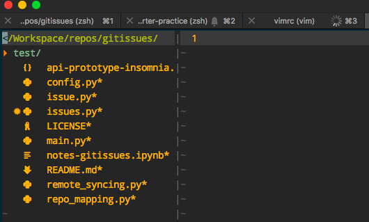
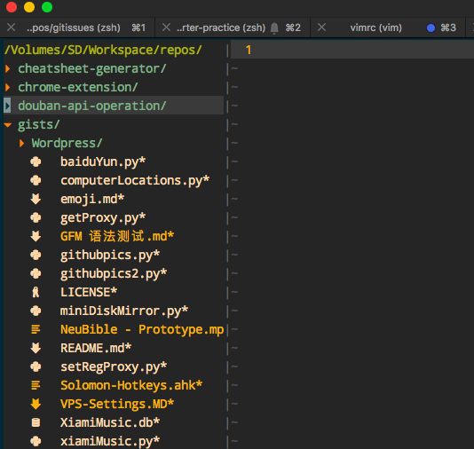

# Vim NerdTree的美化
> 用多了Vim,就需要nerdtree树形菜单，用多了菜单，就像把它美化。

一般最常用的美化Nerdtree插件就是[`vim-devicons`](https://github.com/ryanoasis/vim-devicons)，详细配置方法在github官网有，主要如下：
1. 安装 `Nerd Font`字体，[网址在此](https://github.com/ryanoasis/nerd-fonts)。安装字体的方法每个电脑系统不一样。因为全部字体多到3G，所以最快到方法是到[官网首页](http://nerdfonts.com/)点击Download，下载`Droid Sans Mono Nerd`这个字体，8M左右，下载好了如果是Mac的话，就选择压缩包里的`Droid Sans Mono Nerd Font Complete.otf`，双击安装。
2. 在Terminal.app或iTerm2的系统设置里，设置字体为`Droid Sans Mono Nerd`。
3. 在`~/.vimrc`中插件管理处加入`Plugin 'ryanoasis/vim-devicons'`，重启vim然后`:PluginInstall`进行下载安装。
4. 在`~/.vimrc`中配置默认编码`set encoding=utf8`和默认字体`set guifont=DroidSansMono_Nerd_Font:h11`
完成。
然后就会变成这个样子：

## 进一步美化 `vim-nerdtree-syntax-highlight`插件
[`vim-nerdtree-syntax-highlight`](https://github.com/tiagofumo/vim-nerdtree-syntax-highlight)插件是配合上面`vim-devicons`插件增强的。直接在vimrc中`Plugin 'tiagofumo/vim-nerdtree-syntax-highlight'`，重启并`:PluginInstall`即可。效果如下：

注意：安装完`vim-devicons`后，vim速度已经有些许延迟了，再安装这个插件会感受到更明显的延迟。
