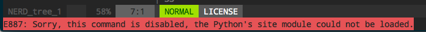
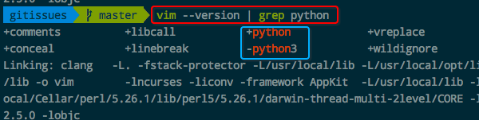
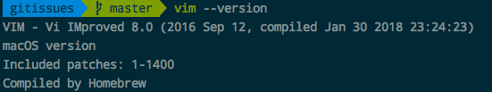
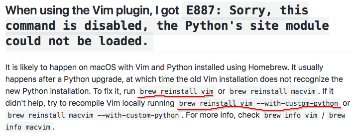

# Vim报错`Sorry, this command is disabled, the Python's site module could not be loaded.`

一般是在系统中改动了python的环境或什么，导致vim的一些插件无法使用python。
测试：在vim里面输入`:py print('hello')`。如果返回这个错误，说明vim没有找到python。
然后在vim里输入`:echo has('python')`和`:echo has('python3')`，哪个显示`0`哪个也是没有的。

通过这个命令，`vim --version | grep python`，我们先查看下当前vim版本对python的支持：

说明我当前的vim支持python，不支持python3.
另外，直接`vim --version`可以先看到，我的vim已经用`brew install vim`更新到了vim 8.0:

所以出错原因就在于这里了。真是不应该随便`brew install vim`，之前vim是7.4。
各种查找资料后（国内解决方案很少，国外解决方案也集中在vim官方github的issues里面），找到[这个简单易懂的方案](https://github.com/editorconfig/editorconfig/wiki/FAQ#when-using-the-vim-plugin-i-got-e887-sorry-this-command-is-disabled-the-pythons-site-module-could-not-be-loaded)：

上面说了，基本大家在Mac上遇到这个问题都是brew升级vim版本后产生的。所以再用`brew uninstall vim`就可以了，如果还不行，就再uninstall后加条件:`brew reinstall vim --with-custom-python`。
再不行的话，就按照本机的python支持情况按个例解决了。
我直接`brew reinstall vim`就解决了。
