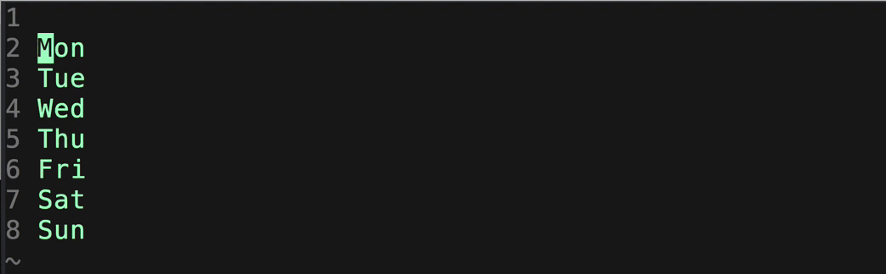

# `Vim的vim-multiple-cursors插件`

[官方Github链接。](https://github.com/terryma/vim-multiple-cursors)

这个插件是可以像Sublime Text一样快捷多选文本的插件。

## 总结

虽然看起来很爽，其实操作起来并没有想象中的那么简单，离Sublime Text的多选便捷度差太远。
而且又要重新学习一套东西，记住一系列的命令。而且还要用到各种方向键。所以还不如用Vim原生的多选功能。真的没有必要。
