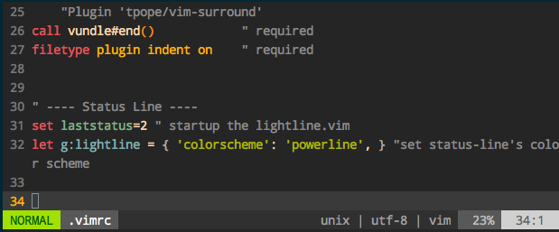
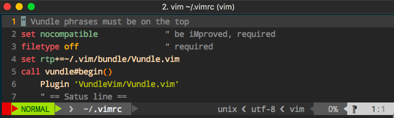
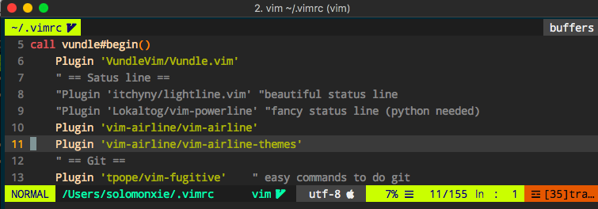

#  ❖ Vim配置状态栏 Status line

Vim里一个好看的状态栏是非常加分的。

### 「vim-lightline」 简单好安装的状态栏

安装方法：
Vundle管理器的话，在`~/.vimrc`中的插件函数中加上：

然后在函数外写上：
```vim
# 把这句加到vundle函数里：
Plugin 'itchyny/lightline.vim'

# 把这两句加到函数外面任意地方：
set laststatus=2
let g:lightline = { 'colorscheme': 'powerline', }
```



## 「vim-powerline」 从入门到放弃

和其它插件一样用Vundle安装：
```vim
# 把这句加到vundle函数里：
Plugin 'Lokaltog/vim-powerline'

# 把这两句加到函数外面任意地方：
set laststatus=2
set t_Co=256
let g:Powerline_symbols= 'unicode'
set encoding=utf8
```

但是安装完了会变成这个样子：



看了很多网上文章，没什么简单有效的方法。先放一放看看有没有别的代替品吧。


## 「vim-airline」 最强最美状态栏

虽说是powerline的fork，但是照我看比powerline强大的多。而且配置简单，效果多样，官方文档很清洗。一步到位。

[参考：Vim-airline 官方文档](https://github.com/vim-airline/vim-airline)
[参考：vim-airline-themes-screenshots](https://github.com/vim-airline/vim-airline/wiki/Screenshots)

安装：
```vim
# 把这句加到vundle函数里：
Plugin 'vim-airline/vim-airline'
Plugin 'vim-airline/vim-airline-themes'

# 把这几句配置加到函数外面任意地方：
" @airline
set t_Co=256      "在windows中用xshell连接打开vim可以显示色彩
let g:airline#extensions#tabline#enabled = 1   " 是否打开tabline
"这个是安装字体后 必须设置此项" 
let g:airline_powerline_fonts = 1
set laststatus=2  "永远显示状态栏
let g:airline_theme='bubblegum' "选择主题
let g:airline#extensions#tabline#enabled=1    "Smarter tab line: 显示窗口tab和buffer
"let g:airline#extensions#tabline#left_sep = ' '  "separater
"let g:airline#extensions#tabline#left_alt_sep = '|'  "separater
"let g:airline#extensions#tabline#formatter = 'default'  "formater
let g:airline_left_sep = '▶'
let g:airline_left_alt_sep = '❯'
let g:airline_right_sep = '◀'
let g:airline_right_alt_sep = '❮'
```

默认安装好后是这样的：



