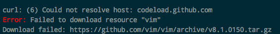

# Homebrew更新后Vim无法打开问题

很久不使用brew安装东西，安装了一个小软件，结果Homebrew直接更新python到3.7版本，然后导致Vim完全无法打开。报错如下：
```
dyld: Library not loaded: /usr/local/opt/python/Frameworks/Python.framework/Versions/3.6/Python
  Referenced from: /usr/local/bin/vim
  Reason: image not found
[1]    38809 abort      vim
```

尝试重新安装Vim：
```sh
$ brew reinstall vim
```
但是经过长时间安装后，仍然失败：



最后通过这个解决：
```sh
$ brew uninstall --ignore-dependencies perl
$ brew uninstall vim
$ brew install vim
```
