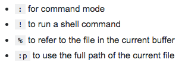

#  ❖ Vim 的文件类型判断 [DRAFT]


## Vim执行当前可执行文件

方法一：
```vim
:! %:p
```
其中：




方法二：
```vim
:! ./%
```
相当于在终端手敲了一遍：`./script.sh`这样的。


## Vim根据不同类型文件设置不同快捷键

因为想做一个IDE中的`build`功能，即针对不同的语言类型，用不同的build／compile／run等方法。
比如我想将这个build映射为`Ctrl+i`。

那么可以用到Vim的`autocmd FileType 语言类型`方式。
其中，`autocmd`相当于`call function()`的call，说明要调用函数了。
`FileType`是Vim自带的一个函数，可以执行当前文件类型的检测。
后面的`语言`相当于传给函数的参数。这个我们可以通过命令`:echo &filetype`获得。

常用的语言类型有：vimrc即vim，zshrc即zsh，tmux.conf即tmux，python，c，cpp等。

我的Mappings：
```vim
    " Filetype based Mappings----{
        " Get current filetype -> :echo &filetype or as variable &filetype
        " [ Builds / Compiles / Interpretes  ]

        " C Compiler:
        autocmd FileType c nnoremap <buffer> <C-i> :!gcc % && ./a.out <CR>

        " C++ Compiler
        autocmd FileType cpp nnoremap <buffer> <C-i> :!g++ % && ./a.out <CR>

        " Python Interpreter
        autocmd FileType python nnoremap <buffer> <C-i> :!python % <CR>

        " Bash script
        autocmd FileType sh nnoremap <buffer> <C-i> :!sh % <CR>

        " Executable
        nnoremap <buffer> <C-i> :!./% <CR>
        "nnoremap <buffer> <C-i> :! %:p <CR>

        " RCs (Configs)
        autocmd FileType vim,zsh,tmux nnoremap <buffer> <C-i> :source % <CR>

    " }
```

