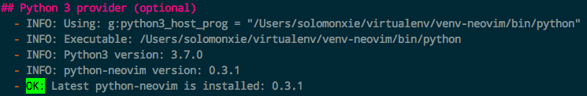

#  ❖ NeoVim初识


## 安装

Mac上安装（无需编译直接解压运行）：
```sh
cd /tmp
wget https://github.com/neovim/neovim/releases/download/v0.3.1/nvim-macos.tar.gz && \
tar -xzvf nvim-macos.tar.gz && \
sudo mv ./nvim-osx64 /opt/nvim-0.3.1 && \
ln -s /opt/nvim-0.3.1/bin/nvim /usr/local/bin/nvim && echo "[ OK ]"

# Check Health
nvim +checkhealth
```

## 添加各种语言支持

NeoVim更像是一个框架，让添加各种支持更加方便。出于这点考虑，原生是不带各种语言支持的，需要自己去安装和关联。

### 添加python支持

假设（推荐）我们使用virtualenv虚拟环境中的python，地址为`~/virtualenv/venv-neovim`。
用`source ~/virtualenv/venv-neovim/bin/activate`开启虚拟环境。然后，

1. 用pip安装neovim模块：
```sh
pip install neovim
```

2. 将vim的`~/.vim`建立nvim的连接（大多数都是通用的不用新创建一个）：
```sh
ln -s ~/.vim .config/nvim
touch ~/.vim/init.vim
```

3. 将虚拟环境的python路径添加到neovim配置文件`init.vim`中：
```vim
let g:python3_host_prog = '/Users/Jason/virtualenv/venv-neovim/bin/python'
```
注意：虚拟环境一定要是**绝对路径**！不能用`~/`这样的。

4. 检查neovim是否已经有了python支持：
```sh
nvim +checkhealth
```

看到这个，就是成功了：



### 添加ruby支持

首先查看本机的ruby在哪个位置：`which ruby`，比如`/usr/local/bin/ruby`。
那么在neovim的配置文件中，加入：
```vim
let g:ruby_host_prog = '/usr/local/bin/ruby'
```

然后在ruby的gem中安装neovim模块：
```sh
$ gem install neovim
```

如果报错：`ERROR:  Could not find a valid gem 'neovim' (>= 0) in any repository`
则需要更新gem：
```sh
# 更新源
gem sources --update

# 或者更换源：
gem sources --add https://gems.ruby-china.org/

# 然后删掉其它所有的源，只保留一个：
gem sources --remove https://rubygems.org/
gem sources --remove http://gems.github.com

# 更新源
gem sources --update

# 重新安装neovim
gem install neovim
```

## 配置 vimrc

官方推荐，neovim的配置文件vimrc位于的`~/.config/nvim/init.vim`。


## 安装插件

推荐用neovim官方推荐的`vim-plug`。

安装到`~/.vim`目录下：
```sh
curl -fLo ~/.vim/autoload/plug.vim --create-dirs \
    https://raw.githubusercontent.com/junegunn/vim-plug/master/plug.vim
```

然后在`~/.config/nvim/init.vim`配置文件中加入引用：
```vim
call plug#begin('~/.vim/plugged')
    Plug 'ncm2/ncm2'
    Plug 'roxma/nvim-yarp'
call plug#end()
```
注意：plug后要用’单引号。

重启nvim后，在neovim中安装应用的命令：`:PlugInstall`


