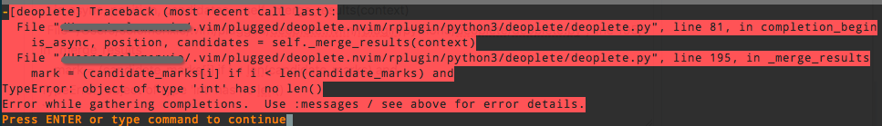

#  ❖ VIM最佳自动补全插件：「deoplete」

> Nvim用的是Shougo开发的NCM，但是在VIM 8+就要用同一个作者开发的Deoplete.

[参考官网：Shougo/deoplete.nvim](https://github.com/Shougo/deoplete.nvim)

**注意：这里只讲怎么给vim8安装。**

## 安装

### 第一步：安装所有依赖
```sh
# 安装VIM 8
# ....

# 安装Python3
# ....

# 安装vim的Python-client库pynvim
pip2 install --user pynvim
pip3 install --user pynvim

# 安装插件 python的neovim库
pip2 install --user neovim
pip3 install --user neovim
```


### 第二步：在vimrc中添加配置
```vim
set encoding=utf-8

set pyxversion=3
" 或
set pyxversion=2

" Python3的可执行文件位置
g:python3_host_prog = "/path/to/bin/python3"


" 在插件管理器中，比如vim-plug中，加入如下：
if has('nvim')
  Plug 'Shougo/deoplete.nvim', { 'do': ':UpdateRemotePlugins' }
else
  Plug 'Shougo/deoplete.nvim'
  Plug 'roxma/nvim-yarp'
  Plug 'roxma/vim-hug-neovim-rpc'
endif
let g:deoplete#enable_at_startup = 1
```
保存重启vim，并在vim中输入命令`:PlugInstall`安装插件。


### 第三步：在vim中输入测试命令

以下命令不能报错才行：
- `:python3 import neovim` 不报错，或
- `:python2 import neovim` 不报错，或
- `:echo has('pythonx')` 返回1
- `:echo exepath('python3')` 能够显示python3的执行文件位置，或
- `:echo exepath('python2')` 能够显示python2的执行文件位置
- `:echo neovim_rpc#serveraddr()` 能显示服务器的IP地址


## 使用方法

在Insert模式下，直接输入文字就会弹出自动补全。然后用`Ctrl+n`和`Ctrl+p`上下选择。


## Add Completion Source 添加补全源

一般如果没有安装任何源，则自动补全只会根据当前文件已有的名字进行猜测。这肯定不是我们要的。
我们要的效果是：根据语言的特性，补全引用自带库、第三方库的所有类、函数等。

[参考官方推荐的各语言的补全源：Completion Sources](https://github.com/Shougo/deoplete.nvim/wiki/Completion-Sources)

### [Python Source]

Deoplete的Python推荐使用`deoplete-jedi`
[参考：zchee/deoplete-jedi](https://github.com/zchee/deoplete-jedi)


安装依赖：
- Neovim and neovim/python-client
    - python-client: `pynvim`
        - `pip2 install pynvim --user`
        - `pip3 install pynvim --user`
- jedi: `pip install jedi --user`

安装方法是利用vim-plug管理器：
```
Plug 'zchee/deoplete-jedi'
```

默认下，什么都不用配置，安装好后就可以很好的用起来了。


### [C/C++ Source]

C／C++用的是`deoplete-clangx`插件，需要本机安装Clang轻量级C编译器支持。

[参考：Shougo/deoplete-clangx](https://github.com/Shougo/deoplete-clangx)

依赖：
- 本机安装Clang
- 已经能正常使用deoplet

然后直接在插件管理器中加入安装即可：
```
Plug 'Shougo/deoplete-clangx'
```


## 更新

如果本机没有`pip2`和`pip3`的话，最方便的是用包管理器重新安装。

Mac上：
```sh
brew install python@2
brew reinstall python@2
```

Ubuntu上：
```sh
sudo apt-get install -y python-pip python3-pip
```


## 更新

如果以上这些都很难满足，那么是时候考虑重新编译VIM了。

如果是Mac的话，可以用`brew install vim --with-cscope --with-python --with-lua --override-system-vim`直接按照可选的语言支持编译vim。

测试可行


## TypeError: object of type 'int' has no len()

因为Mac本机中的Homebrew重装导致一系列毛病。Deoplete也无法正常使用。无论是vim还是neovim，每次需要弹出补全提示的时候，都会报错，错误如下：



```
[deoplete] Traceback (most recent call last):
  File "/Users/Jason/.vim/plugged/deoplete.nvim/rplugin/python3/deoplete/deoplete.py", line 81, in completion_begin
    is_async, position, candidates = self._merge_results(context)
  File "/Users/Jason/.vim/plugged/deoplete.nvim/rplugin/python3/deoplete/deoplete.py", line 195, in _merge_results
    mark = (candidate_marks[i] if i < len(candidate_marks) and
TypeError: object of type 'int' has no len()
```

解决方法：一顿乱七八糟的重新安装。

按顺序，需要重新安装的有：
```sh
brew uninstall vim neovim
brew uninstall python python3 python-pip python-pip3
brew uninstall ruby

brew update && brew upgrade && brew cleanup && brew doctor

brew install python python3 python-pip python-pip3
brew install ruby
brew install nodejs
brew install vim neovim
brew link vim
brew link ruby
brew link python

pip install --user pynvim neovim nvim jedi
```

## Vim8中报错：E887: Sorry, this command is disabled, the Python's site module could not be loaded.

同样因为Mac本机中的Homebrew重装导致一系列毛病。Deoplete也无法正常使用。每次需要弹出补全提示的时候，都会报错，错误如下：

有人说参考：https://github.com/editorconfig/editorconfig/wiki/FAQ#when-using-the-vim-plugin-i-got-e887-sorry-this-command-is-disabled-the-pythons-site-module-could-not-be-loaded
但是没用。

参考这篇日文的就解决了：http://siragumohuin.hatenablog.com/entry/2016/09/30/034000

```sh
brew reinstall vim --HEAD
```
