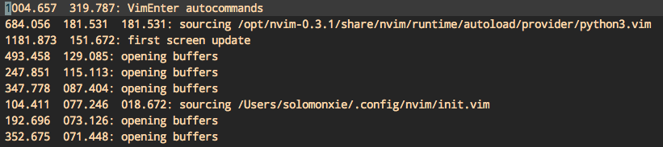
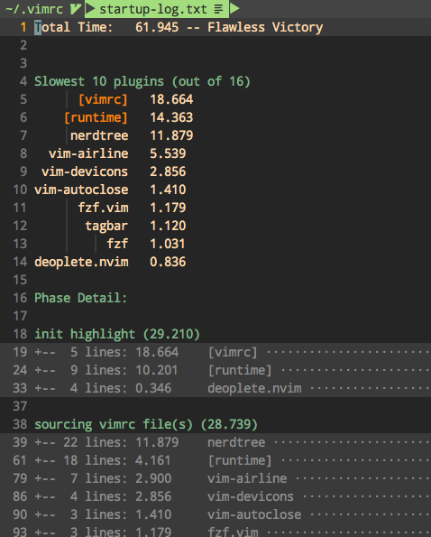
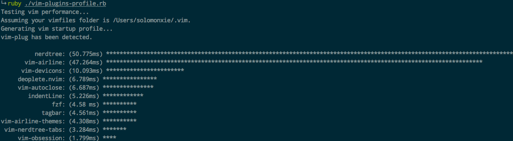
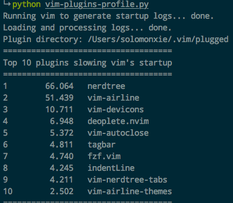

#  ❖ VIM加速


## 使用VIM内置命令查看加载时间

[参考：vim 启动速度优化的一些经验](https://zhuanlan.zhihu.com/p/24484514)

```sh
$ vim --startuptime /tmp/vim.log ~/.vimrc +qall && cat /tmp/vim.log |sort -nrk 2
```
然后就能看到各个环节加载时间，以ms毫秒为单位，即小数点**前面**是毫秒数。
其中第一列是时间点，第二列是时长，我们主要关注第二列。
一般标准： ”200ms 以下感觉是很好的，超过 500ms 会觉的有点卡，如果超过 1s 就会觉得非常难受了“

一般影响速度的元素：
- `语法高亮插件`
- `系统函数调用`: has()和system()都属于系统级查询，效率极低，尽量减少使用。
- `Nerdtree`等文件浏览插件相比于tagbar、fzf等都要多用10倍时间，出乎意料




## 使用第三方脚本分析VIM加载


### startuptime.vim

[参考：tweekmonster/startuptime.vim](https://github.com/tweekmonster/startuptime.vim)

安装好后直接用`:StartupTime`显示分析结果，非常快。




### vim-plugins-profile

[参考：hyiltiz/vim-plugins-profile](https://github.com/hyiltiz/vim-plugins-profile)

```sh
git clone https://github.com/hyiltiz/vim-plugins-profile.git
cd vim-plugins-profile

# 用Ruby生成分析结果 （较少依赖）
ruby ./vim-plugins-profile.rb   #命令行显示结果 无需依赖

# 用Ruby生成NeoVim的分析结果
ruby ./vim-plugins-profile.rb nvim

# 用Python生成分析结果（图片）
python vim-plugins-profile.py    #命令行显示结果
python vim-plugins-profile.py -p # 生成条形图，需要matplotlib和SciPy的Pylab依赖

# 命令行中查看分析结果
bash ./vim-plugins-profile.sh  #需要R语言和其插件依赖，较慢
```

如果是Bash执行，则会自动安装R语言等依赖`R:ggplot2 `。
如果是Python执行，则会安装`matplotlib`和`pylab`等绘图包依赖。
如果是Ruby执行，暂时不需要依赖。

推荐使用Ruby。

Ruby生成的命令行结果：


Python生成的命令行结果：



## 根据系统判断使用哪些插件

> 注意：VIM的has()属于系统级查询，效率极低，拖慢速度。尽可能减少使用。

完整OS列表：win32, win64, mac, macunix, unix

如果是Mac，则加载这个插件：
```vim
if has('mac')
    Plug 'xxxxxx'
endif
```
