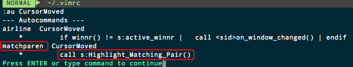

# VIM 光标移动缓慢 
`vim Highlight_Matching_Pair slow`

Mac上没感觉，但是同样的配置在树莓派上很糟糕，jk移动都非常缓慢，大概等接近一秒才能反应，这让人有点不能忍。

通过开启`:set verbose=9`追踪发现，每次jk移动都会执行一个`call s:Highlight_Matching_Pair`这样的函数，很明显是高亮对应的括号这样的功能。

同样，我们也可以通过`:au CursorMoved`查看鼠标移动时定义的调用。


查看后发现是来自`matchparen.vim`这个内置插件中的方法。
于是搜了一下，在这个vim脚本中发现关闭的方法：`: NoMatchParen`，就会关闭一切自动配对高亮了。如果再开启，就输入`: DoMatchParen`

[参考：Disable Highlight Matched Parentheses in ViM : “let loaded_matchparen = 1” not working](https://stackoverflow.com/questions/34675677/disable-highlight-matched-parentheses-in-vim-let-loaded-matchparen-1-not-w)

有人建议开vim后自动关闭它：
```vim
" Disable parentheses matching depends on system. This way we should address all cases (?)
set noshowmatch
" NoMatchParen " This doesnt work as it belongs to a plugin, which is only loaded _after_ all files are.
" Trying disable MatchParen after loading all plugins
"
function! g:FuckThatMatchParen ()
    if exists(":NoMatchParen")
        :NoMatchParen
    endif
endfunction

augroup plugin_initialize
    autocmd!
    autocmd VimEnter * call FuckThatMatchParen()
augroup END
```

发现的确关闭了。但是好像jk的速度还是一样。
