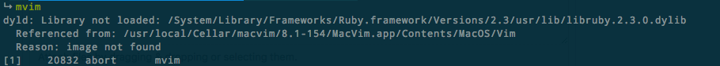

# [放弃] ~~MacVim: Mac终端Vim的正确方式~~

原本以为MacVim是GUI的Vim，所以嗤之以鼻。
但是了解到很多人用MacVim包里的mvim程序作为终端vim的替代品，像nvim一样，所以尝试了一下。

不需要下载GUI版本的MacVim，直接
```sh
$ brew install macvim
```
这样就在终端里可以运行`mvim`了。


## 因为ruby版本找不到的问题，mvim一直无法正确运行



试过了：
```sh
$ install_name_tool -change /System/Library/Frameworks/Ruby.framework/Versions/2.0/usr/lib/libruby.2.0.0.dylib  /System/Library/Frameworks/Ruby.framework/Versions/2.3/usr/lib/libruby.2.3.0.dylib /usr/local/Cellar/macvim/8.1-154/MacVim.app/Contents/MacOS/Vim
```
还是一样。


## 放弃终端的macvim

由于macvim带来很多配置错误，得不偿失。原本装macvim就是以为会比vim8和neovim少一些安装错误，多一些稳定性，结果带来更多麻烦。索性放弃

