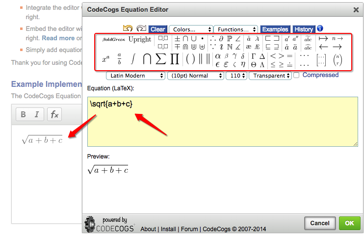

# Markdown中插入数学公式
以下方法：
- Google Charts API（根据url地址返回公式图片）
- [Forkosh](http://www.forkosh.com/mathtex.html)（根据url地址返回公式图片）
- [Codecogs](https://latex.codecogs.com/)  （根据url地址返回公式图片）
- MathJax 引擎（引入js文件渲染markdown中LaTex公式）

## Google Charts API 制作数学公式图
都知道Markdown中插入公式不易，需要平台自己提供LaTex渲染引擎。
如果是自己的平台倒还好说，很简单引入一个js文件即可。
但是Github的README和issues等都默认是不支持LaTex的，也不能插入外部js文件。
所以在Github中显示正常的公式唯一的方法就是引用公式的图片。
目前最流行的是Google Chart API和Forkosh服务器，但是forkosh服务器连接不畅，除非自己架服务器搭建forkosh平台，否则就只能选google了。

[参考文章。](https://www.jianshu.com/p/888c5eaebabd)

用法如下：

```

```
注意：公式虽然是LaTex语法，但是特殊符号必须经过url编码才行，否则Github不显示。
例：
```
https://chart.apis.google.com/chart?cht=tx&chf=bg,s,FFFF00&chl=%0D%0A4x_0%5CDelta%28x%29%2B3%5CDelta%28x%29%2B2%5CDelta%28x%5E2%29%3E0%0D%0A
```


## Codecogs 制作数学公式
相比Google来说，Codecogs采用了一样的url引用方式，一样的语法，且也必须是url编码。但是Codecogs提供了一个网页编辑器，可以直接在上面可视化编辑公式，然后直接拷贝图片链接即可，所见即所得，要快捷的多了。
当然如果在意服务器稳定性还是想用Google的话，那还可以把图片链接前面直接改成Google api的地址即可。



生成好图片后，直接右键点击生成的图片获取链接即可。
