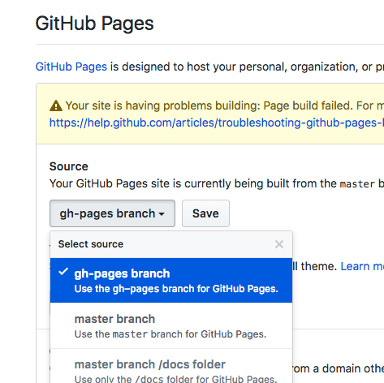

# 将Jekyll Themes模版部署到Github Pages [DRAFT]

基本步骤：
- 下载一个完整的模版: `git clone .....`
- 修改配置文件： `_config.yml`
- 提交代码到自己repo的gh-pages分支：`git push origin gh-pages`
- 在repo的网页settings中修改Github Pages所读取的分支为`gh-pages`

