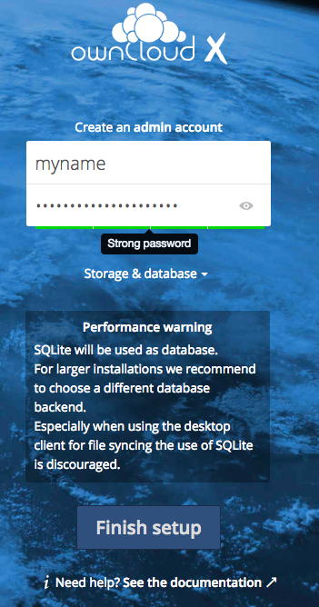
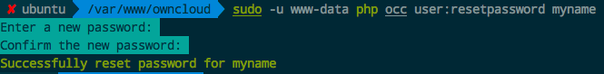

# Ubuntu服务器安装OwnCloud私有云盘 [DRAFT]


## 安装步骤（不要全部复制，部分手动）
```sh
sudo apt-get update

# 下载Owncloud所需依赖
sudo apt-get install -y apache2 mariadb-server libapache2-mod-php7.0 \
    openssl php-imagick php7.0-common php7.0-curl php7.0-gd \
    php7.0-imap php7.0-intl php7.0-json php7.0-ldap php7.0-mbstring \
    php7.0-mcrypt php7.0-mysql php7.0-pgsql php-smbclient php-ssh2 \
    php7.0-sqlite3 php7.0-xml php7.0-zip


# 下载并解压最新版本OwnCloud（自行前往官网找到地址）
# Download the latest version form the webpage: 
wget https://download.owncloud.org/community/owncloud-10.0.8.tar.bz2
# Download the related MD5 checksum file:
wget https://download.owncloud.org/community/owncloud-10.0.8.tar.bz2.md5
# 验证文件有效性
# Verify the MD5 sum:
md5sum -c owncloud-10.0.8.tar.bz2.md5 < owncloud-10.0.8.tar.bz2
# Download the PGP signature:
wget https://download.owncloud.org/community/owncloud-10.0.8.tar.bz2.asc
wget https://owncloud.org/owncloud.asc
# Verify the PGP signature:
gpg --import owncloud.asc
gpg --verify owncloud-10.0.8.tar.bz2.asc owncloud-10.0.8.tar.bz2
# 解压文件并移动到Apache服务器目录中
# Unarchive the Owncloud package
tar -xjf owncloud-10.0.8.tar.bz2
# Copy the folder to Apache Webserver root path
sudo cp -r owncloud /var/www
# Give permission for ownCloud to read/write the folder
sudo chown -R www-data:www-data /var/www/owncloud


# 配置Apache服务器
sudo touch /etc/apache2/sites-available/owncloud.conf
sudo cat > /etc/apache2/sites-available/owncloud.conf <<EOF
Alias /owncloud "/var/www/owncloud/"

<Directory /var/www/owncloud/>
  Options +FollowSymlinks
  AllowOverride All

 <IfModule mod_dav.c>
  Dav off
 </IfModule>

 SetEnv HOME /var/www/owncloud
 SetEnv HTTP_HOME /var/www/owncloud

</Directory>
EOF
# Then create a symlink to /etc/apache2/sites-enabled:
sudo ln -s /etc/apache2/sites-available/owncloud.conf /etc/apache2/sites-enabled/owncloud.conf
 
# 开启Apache服务器相关模块和服务
sudo a2enmod rewrite
sudo a2enmod headers
sudo a2enmod env
sudo a2enmod dir
sudo a2enmod mime 
# Enable SSL (for https)
sudo a2enmod ssl
sudo a2ensite default-ssl
sudo service apache2 reload
# 重启Apache
sudo service apache2 restart


# 打开浏览器前往 `http://<本机IP>/owncloud` 配置服务
echo "Please proceed to your web browser and open http://<IP>/owncloud to finish the setup."

echo "========== (Enable Local External Storage, etc., Hard disk, flash disk) ==========="
echo "Please add 'files_external_allow_create_new_local' => 'true', to /var/www/owncloud/config/config.php"
echo "Refresh web browser to see the change."
# Enable Local External Storage 
#sudo vim /var/www/owncloud/config/config.php
# Add this phrase into the array to enable local external storage
#'files_external_allow_create_new_local' => 'true',


echo "========== (OwnCloud Installing Finished) ==========="

```

## 初始配置
安装好后，访问`http://你的IP/owncloud`，就能看到这个画面，要求你设置初始用户名密码：



重制密码方法：
```sh
$ sudo -u www-data php occ user:resetpassword <用户名>
```



## 开启Https支持(SSL)
