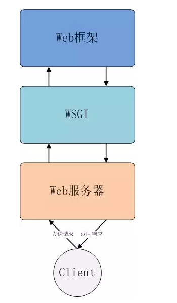

# ❖ Web Application 网络应用框架理解

一个Webapp Framework框架，不同于Web Server (或HTTP Server)。

Webapp框架的核心作用只有：
- `CGI`：实现路由，即把网络请求翻译成具体的编程语言
- `Template`：展现业务视图，即在静态HTML中加入动态语言变成动态HTML

Webapp框架的轻重：
轻量级的框架只实现基本的路由和视图，而重量级的框架则在此基础上实现了各种各样丰富的组件和插件。
轻量级的使用简单、自由灵活、轻松扩展，重量级的具备完备的网络应用组件如数据库操作、登录、产品展示等拿来直接用，但是不够灵活。

常用Python框架：
- 重量级
    - Django
- 轻量级
    - Flask
    - Tornado

如何理解Webapp框架在网络模型中的意义？

[参考：如何理解Nginx、uWSGI和Flask之间的关系？](http://python.jobbole.com/87588/)

实际上客户访问到具体的网络服务需要走过三大组件：Client -> HTTP Server -> CGI -> Webapp Framework。
其中HTTP Server只处理基础的TCP／UDP等网络请求，得知请求的是那个具体的应用程序后，把具体内容转发给CGI翻译器，然后CGI把网络请求翻译成具体的编程语言，比如Python，然后发给对应的Webapp Framework，具有编程语言特性的Framework把请求处理好了，再回复给CGI，再回复给HTTP server，再给客户。

