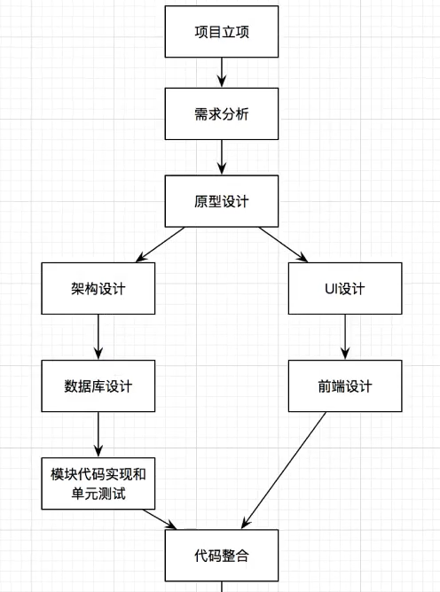

# ❖ WebApp 网络应用项目建立的基本流程 [DRAFT]

## 项目立项和定位

- B2B
- C2C
- B2C
- C2B
- B2B2C

## 需求分析 Requirements Analysis

## 原型建立 Prototype

## 开发流程

## 项目架构 Project Architecture

项目架构：
- 功能模块的划分和架构
- 技术栈选择：编程语言、第三方框架、数据库服务器等
- 部署架构：服务器选择、集群等

## 数据库设计 Database Design

- 数据表和字段设计
- 表关系设计

## 模块代码实现和单元测试 Modules Implementation & Unit Test

- 模块分工
- 实现代码
- 单元测试

## 前端设计  Frontend Design

- UI设计
- 前端实现

## 前后端代码整合 Frontend & Backend Integration

## 集成测试 Integration Tests

## 发布 Publish

