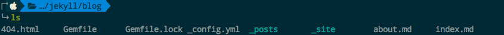
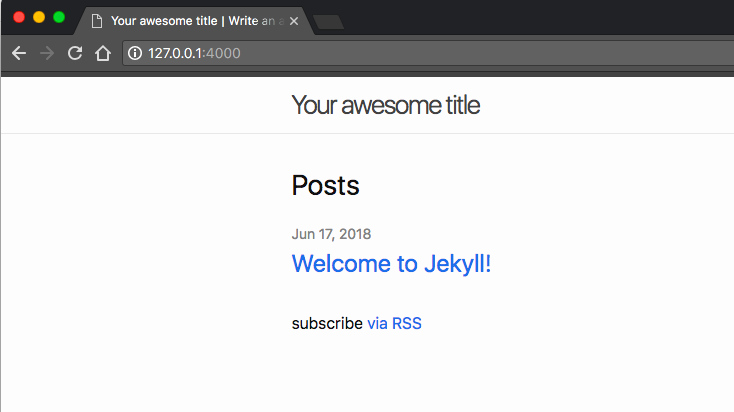
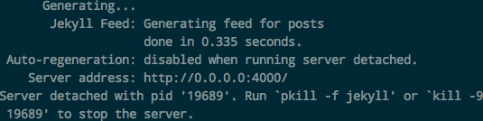
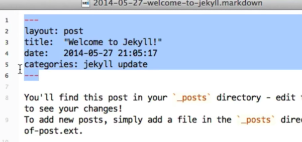

# ❖ Jekyll 动态地建立静态博客网站 (Get Started)

> 提前声明：Jekyll并不简单，必须要正确的看待它。把它和PHP，JSP和Django等放在一起讨论会减少很多失落感。它的学习曲线几乎相当于Wordpress，工作流程和结构也几乎一样。

Jekyll与Wordpress最大不同的就是，没有数据库。但是体验上来说也算不上什么大差别。
彻底摒弃数据库，这算是一种Jekyll式的**新思路**。
因为你需要的只是定期更新一些Markdown格式的文章，然后让它显示成网页，并放在一起成为网站而已。没必要大动干戈的设计数据库什么的。

简单的说，Jekyll是一个基于Ruby语言的静态博客网站制作工具，它可以把Markdown转换成HTML网页。

不过对于一个HTML网页来说，它得有标题、样式、日期什么的，甚至一些根据文章的不同而动态改变的内容等。这些就不仅是把Markdown转换成HTML而已了。很多内容需要你在Markdown文件里面就写明指定。

> 另注：Jekyll虽然和Github Pages搭配免费，但其实是完全独立的产品。可以在任何地方使用，像Wordpress一样。

## 安装Jekyll

安装Jekyll需要用Ruby的包管理器gem下载，像Python的pip一样：
```sh
$ gem install jekyll
```

但是如果本机的gem版本不够新，是装不了jekyll的，所以就依照官网从ruby从头开始安装：
```sh
sudo apt-get install ruby ruby-dev build-essential

echo '# Install Ruby Gems to ~/gems' >> ~/.bashrc
echo 'export GEM_HOME=$HOME/gems' >> ~/.bashrc
echo 'export PATH=$HOME/gems/bin:$PATH' >> ~/.bashrc
source ~/.bashrc

gem install jekyll bundler
```

用Jekyll创建一个网站（自动生成名为test_blog的文件夹和一个完整的Demo网站）：
```sh
$ jekyll new test_blog
```
目录里面内容如下：

这里面是完整的一个网站，可以直接运行浏览。
然后你就可以根据自己的主页、其它网页什么的，在这个基础上修改了。

### Jekyll new时发送错误：`Bundler: ruby: No such file or directory`
我的Mac机上从来没做过任何Ruby项目，也不懂gem使用方法。全部原始配置后，使用`gem install jekyll`没问题，但是在`jekyll new ..`时，就发送这个错误：
```
Bundler: ruby: No such file or directory -- /usr/local/lib/ruby/gems/2.5.0/gems/bundler-1.16.1/exe/bundle (LoadError)
```
发生错误后，项目文件夹是生成了，但是不完整，也不能执行。

问题在于本机的gem和bundler都不是很新，需要更新一下。
参考：https://github.com/rubygems/rubygems/issues/2180#issuecomment-369423426

更新如下：
```sh
# Install latest version of Rubygems
gem update --system

# Install latest version of bundler system-wide
gem install bundler
```
更新时间会很长，等全部安装好后，就可以正常的使用jekyll了。


## 生成网站

渲染网站
```sh
$ cd test_blog
$ jekyll serve
```
或实时渲染网站：
```sh
$ jekyll server --watch
```
如果加上了`--watch`参数，jekyll就会实时监控你的文件，只要那个文件有变动了，比如新增了markdown文件，或修改了layout模板，它都会即时渲染生成网站，总保持更新。

运行渲染的命令后，jekyll就会把你的Markdown根据指定的模板渲染为静态网站，
同时还会把网站映射到本机的一个端口，你可以打开命令行里提示的url链接察看网站效果。




## 允许公网访问
如果jekyll部署在了公网上的服务器上，那么很轻松就可以公开给所有人访问了。
语法如下：
```sh
$ jekyll serve --detach  --host 0.0.0.0

# 或
$ jekyll serve --force_polling -H 0.0.0.0 -P 4000
```

然后就会显示如下：


也就是说公网运行jekyll的话，程序就转到后台了，需要退出的话需要手动关闭进程。

然后根据网站设计时候指定的端口，相应的在服务器防火墙上开放这个端口，比如4000。
然后用`http://服务器IP:4000`这样的就能访问了。
如果要不带端口号访问，就在`_config.yml`中把端口号设计为80。（但是经常有冲突，需要解决）


## Jekyll Workflow 工作流程
使用Jekyll，主要难就在一开始，需要设计网页样式，设置全站的规则等等。
但是一旦这些基本设置都完成了，以后更新就只需要专注的写Markdown文件即可。


## Jekyll自定义网站
`Jekyll new`命令新建一个网站结构后，文件夹里面有很多文件。这些文件结构都是什么作用，是我们必须要学习的。

### Jekyll文件夹结构

- `_config.yml`文件：这是你第一个需要修改的东西。全网站的通用设置都保存在这里，比如网站主题，名称，介绍，域名，Github用户名等。`.yml`是像`.ini`一样的配置文件类型。
- `_site`文件夹：这个存放你的完整静态网站的文件夹，但是这是不需要你去碰的文件夹，它是Jekyll根据你的设置和模板之类的内容，自动生成的静态网站。
- `_layout`文件夹：是存放各种网页模板的地方，主页什么样子，列表页什么样子，博客内容页面什么样子，这些分别的页面模板都是放在这里的。
- `_includes`文件夹：存放所有重复使用的、比较固定的页面模块。比如每个网页都一样的页头、页脚，导航栏，侧边栏等等。这里面的HTML文件，都不是完整的HTML网页，都只是模块，可能只是一个`<div>`标签。
- `_posts`文件夹：存放所有的Markdown格式文件。你所有的Markdown博客内容，都放在这里。文件命名也是有规定的，比如必须是`data-filename.markdown`这种。


注意：
- `_site`文件夹需要你在`.gitignore`中加入屏蔽，因为这个动态生成的东西，完全不需要在git里面进行追踪。而且放在Github Pages上的话，Github引擎也不会在你的目录里面生成这个文件夹，而是在后台直接给你生成页面。之所以会有它，主要是本地设计时候用。

### `Front-Matter 文件头信息`
文件头信息在这里被叫做`front-matter`,或`yml-header`，它是写在每个Markdown文件头部的设置信息。主要是指明这篇文章标题、日期、使用的模板、样式、标签、分类等，这样Jekyll就可以根据这些设置把markdown文件转换成你想要的最终HTML网页了。



头信息的常用参数如下：
- `layout`: 指明模板名称，即指定使用`_layout`文件夹中哪个HTML网页做为模板。
- `title`: 这篇文章的标题。
- `data`: 这篇文章的日期。
- `categories`: 这篇文章的分类。


## “真正的”拿到Jekyll生成的静态网站

Jekyll的最终目标和整个存在意义都是生成静态网站。
但是，
默认情况下，所谓生成出来的静态HTML页面，你也**不能**直接打开看到效果！必须要运行`jekyll serve`才行，或者把它放到Github的Repo里。
那还叫什么静态网站？！
真正的静态网站不是生成HTML就行了，而是让你双击打开HTML就能在浏览器看到效果。

避开这个有点矛盾的逻辑不说了，我们有比较方便的外部工具来做到这点。
那就是最常用的`wget`下载命令。
`wget`可以把网页或整个网站下载下来，并且能自动转换各种文件里的路径。
命令如下：
```$
$ wget -r --convert-links <URL>
```
所以当你运行`Jekyll serve`成功编译生成`_site`目录后，就可以用wget下载本地的这个网站了。


## Jekyll的体验

目前体验极其糟糕：
- 不能**真正**生成静态网站，必须开着Jekyll服务才能展示出网页
- Macbook air上运行jekyll服务器不到一会儿，CPU温度就极速增高
- 大概几十篇文章，就需要10s+的生成时间
- 各个主题安装极其不同，每个主题都需要单独学习其内在逻辑、变量、结构、生成方法，学习成本非常高
- 依赖性极高，很容易导致gem或nodejs依赖过期无效或出错
- Jekyll对配置文件的tokens（比如指定变量名）经常改变和更新，很快你写的配置文件就不管用老报错了。

