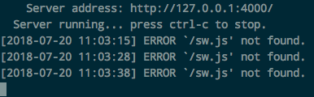

# ❖ Jekyll 第三方模版安装运行：从入门到放弃

实际上，Jekyll安装主题是非常反人类的——它一点也不比自己写模版简单，学习成本真是高。
安装主题不是把人家做好的template直接复制过来就能用了。
每个模版设置的变量设置名、依赖的gem包都不一样，还经常需要在本地安装所有依赖包，安装jekyll插件等。如果不懂Ruby gem的话，还真是不简单。

到了这里，一般人真的会问自己应不应该再继续下去。因为明明简单的东西，不知道是不是还值得了。

> 我相信所有坚持学习jekyll的人，都有自己非学不可的理由吧。


## 包管理器的理解
Jekyll是用Ruby语言构建的，且每个主题都会有超多的Ruby依赖包。在这里需要先理解一些基本概念才能进行下去。

- `Ruby`：是语言。这就不说了
- `Gem`：全称`RubyGems`，是Ruby的包管理器。相当于Python的pip。每一个包都叫`a gem`，在Python里叫`package`.
- `Bundler`：是管理gem管理器的管理器……相当于Python的pipenv，管理每个项目的gem包依赖。

简单说，gem主要管理整个系统的Ruby包，下载安装卸载之类。而Bundler只负责管理每个项目的Ruby包依赖。


## 一般安装方法
先讲讲一般通用的模板安装方法：
- 首先到模版的Github网页里clone下来全部文件。
- 在命令行里打开这个模版的文件夹（其实它就是一个完整的Jekyll文件夹结构）
- 首先直接运行这个主题：
```sh
$ jekyll serve
```
- 如果没有出错能直接使用最好，出错的话就走下一步。
- 输入以下命令安装模版所需的依赖环境：
```sh
$ bundle install
```
- 这样`bundle`命令就会会根据文件夹中的`Gemfile`文件下载安装所有模版所需的依赖环境。
- 静等结束之后，一般就可以`$ jekyll serve`直接运行网站了。
- 打开jekyll提示的网站，到处点一点，如果网站能正常运行，那么就可以把自己的markdown文章导入到`_posts`文件夹里了。
- 然后在每篇markdown文章的`Front Matter`里，把`theme`改成这个模版的名称，`layout`改成这个模版要求的layout等。
- 然后重新运行`jekyll serve`，开始运行服务。
- 复制命令行里提示的本地url地址(每个主题的地址都不同)，在浏览器里打开，就可以在网站上看到更新了。
- 如果出错，可以试试下面命令来启动服务，强制服务在当前依赖环境下运行。
```sh
$ bundle exec jekyll serve
```

至此，一般简单的模版都可以搞定了。如果超出任何以上提及内容，我们就要到"特殊安装方法"一节来分析了。


## 特殊安装方法
一般安装方法解决不了的，基本上算是特殊安装方法了。

经过我尝试了下载和安装几十个下载的主题后，发现如果碰见一个连`bundle install`命令都不用，直接`jekyll serve`就打开服务的，那简直是像中大奖一样的。
每个主题的安装都不太一样，且遇到的错误都完全不同。通用性极其小。

要想真正安装好一个主题，必须掌握基本的Debug能力，命令行信息的理解能力，如果精通Ruby那么就再好不过了。

基本上**我不打算**在这里浪费时间把这些情况列出来讨论，只是想把坑分享出来，提醒你不要跳。

如果不是100%确定真的想用这个主题，就不要浪费时间去调试和修改gem环境了，不值得。

> 我的经验是：安装越麻烦的，模版本身其实反而更丑更差劲👎。


## 涉及Node.js技术的模版安装方法
Github社区里的Jekyll模版流行使用nodejs的npm的gulp来编译scss这些东西。
所以如果你没注意到主题的说明文档里提到的`gulp`, `npm`之类，就会发现用`jekyll serve`无法进行网站生成。

这种情况下，只需要：安装`Node.js` -> 使用`npm` -> 安装`gulp` -> 命令行使用`gulp`编译网站中的css文件。不过大多数情况下你的机器已经自带了nodejs和npm（Windows除外），所以：
```sh
$ cd <主题的目录>

# 安装此项目的依赖环境
$ npm install

# 编译此项目中的相关文件
$ gulp run
```

小1分钟后，就会看到gulp开启了一个端口，并自动打开了你的chrome浏览器，打开了这个项目的网页（你会看到无法显示出正常效果，因为这里gulp这是用来编译css的，它运行不了jekyll项目）。
然后ctrl+c退出，再打开jekyll命令编译网站就行了-_-!

> 吐槽一下：请回想，为了安装个jekyll和主题，此时你已经经历了一个真的不算短的学习历程了：
GitHub Pages -> Jekyll框架 -> `.yml`文件语法和配置 -> Liquid动态语言 -> Ruby -> gem -> bundle -> HTML+CSS+JS -> nodejs -> npm -> gulp……
这其中哪一步都值得说上一段时间。
然后回想起当初，其实你只是想在GIthub Pages里建个静态网页而已。


## 常见问题

## 运行Jekyll serve 总报错： ERROR `/sw.js' not found


[根据这个Stackoverflow的回答](https://stackoverflow.com/questions/51201045/jekyll-serve-error-sw-js-not-found)：
`sw.js`是Service worker的意思，是自动生成的。
基本上不会造成什么影响，但是主要出现这个错误，jekyll就没法同步更新。

根据我的实际体验，这不是主题的问题，而是jekyll的问题：对每个主题都报有这个错误。
