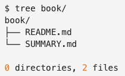

# 利用「Gitbook」快速构建专业文档、个人博客

不像Readthedocs那么复杂，Gitbook所需的文件和设置极其少，而且原生支持Markdown和Github仓库自动同步。

一般本地无需安装，只要在Github中存入相应的Markdown文件就能自动生成了。
不过为了随时测试和预览，有必要在本地也弄一套。

[参考：GitBook 简明教程](http://www.chengweiyang.cn/gitbook/index.html)

安装(不要安装旧版的`gitbook`，而应该是`gitbook-cli`)：
```sh
$ sudo npm install gitbook-cli -g
```

常见安装问题：
```sh
#如果提示`npm`版本过低，则升级npm：
$ npm i npm@latest -g

#如果提示网络问题，则用-d参数
$ npm install gitbook -g -d

#如果网络还是有问题，则用代理联网
$ npm config set proxy http://127.0.0.1:1080
$ npm config set https-proxy http://127.0.0.1:1080
```

> gitbook程序和npm的问题太多，我在Mac本机、Ubuntu国外服务器上测试都装不好。所以只能使出最终杀器：`docker`.

gitbook有官方的Docker Hub账号，但是好像没有官方的gitbook程序image。推荐第三方排名较高的[`billryan/gitbook`](https://hub.docker.com/r/billryan/gitbook/)。

在本机已有docker的情况下，如此运行：
```sh
# 对当前文件夹进行gitbook初始化（容器在命令执行完后会自动消失 因为--rm选项）
$ docker run --rm -v "$PWD:/gitbook" -p 4000:4000 billryan/gitbook gitbook init

# 对当前文件夹的gitbook编译并提供预览（容器在命令执行完后会自动消失 因为--rm选项）
$ docker run --rm -v "$PWD:/gitbook" -p 4000:4000 billryan/gitbook gitbook serve

# build
$ docker run --rm -v "$PWD:/gitbook" -p 4000:4000 billryan/gitbook gitbook build

# 最高将docker变成alias快捷键，相当于本机的gitbook命令了
$ alias gitbook='docker run --rm -v "$PWD":/gitbook -p 4000:4000 billryan/gitbook gitbook'
```
以上docker会把当前文件夹映射为虚拟系统里的`/gitbook`文件夹，并且将4000端口映射到本机的4000.而且由于--rm选项，docker不会存储container。这样一来就和本机安装的gitbook没什么两样了。


本地项目创建及初始化：
```sh
# 初始化本地一个项目
$ cd book
$ gitbook init

# 编译并预览书籍（生成好后，会显示一个本地链接，可以在浏览器里打开预览）
$ gitbook serve
```


如果提示类似这样的错误：`Error: ENOENT: no such file or directory, stat '/gitbook/_book/gitbook/gitbook-plugin-lunr/lunr.min.js'`
那么就需要安装插件。首先要在项目根目录下新建一个`book.json`文件，内容如下：
```
{
        "plugins": [
                "fontsettings",
                "sharing",
                "lunr",
                "search",
                "highlight",
                "livereload"
        ]
}
```

然后运行命令`gitbook install`安装这些插件。之后就应该没问题了。


基本文件结构：


Gitbook至少需要两个文件:
- `README.md`：相当于书籍简介
- `SUMMARY.md`：这个非常重要，定义了整个目录结构和相应的文件链接


`SUMMARY.md`目录文件格式：
Gitbook的目录最多支持3级。
- 标准格式：
```
* [第一章](section1/README.md)
    * [第一节](section1/example1.md)
    * [第二节](section1/example2.md)
* [第二章](section2/README.md)
    * [第一节](section2/example1.md)
```
- 利用标题或分割线：
```
# Summary

### Part I

* [Introduction](README.md)
* [Writing is nice](part1/writing.md)
* [GitBook is nice](part1/gitbook.md)

### Part II

* [We love feedback](part2/feedback_please.md)
* [Better tools for authors](part2/better_tools.md)

----

* [Last part without title](part3/title.md)
```


