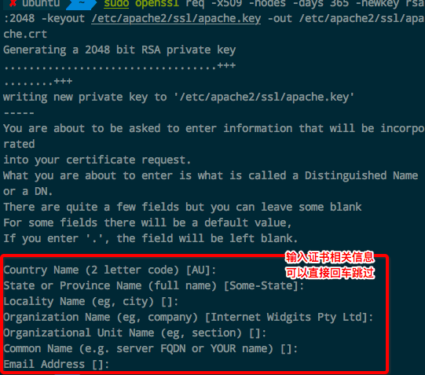
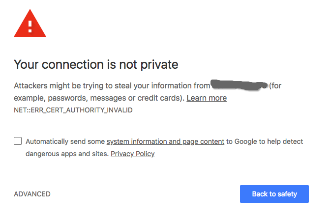

# Owncloud 开启Https(SSL)支持（Apache2）

[参考：为ownCloud配置SSL连接](https://www.cnblogs.com/findumars/p/4862162.html)

创建SSL证书：
```sh
# 创建一个文件夹 用来存储证书
$ sudo mkdir /etc/apache2/ssl

# 创建一个365天有效期的证书（然后进入交互输入相关信息）
# 包括apache.key和apache.crt文件（扩展是什么无所谓）
$ sudo openssl req -x509 -nodes -days 365 -newkey rsa:2048 -keyout /etc/apache2/ssl/apache.key -out /etc/apache2/ssl/apache.crt 
```




创建好后，就可以在apache的配置里面引用这个SSL证书了。
但是因为这个证书是自己创建而不是第三方公司的，所以不会被任何浏览器信任，每次都会出现`NET::ERR_CERT_AUTHORITY_INVALID`错误：



这个是没办法解决的，只能点击`proceed`继续前往。然后看到地址栏里一直会有这个提示，非常醒目：


如果这个可以忍的话，那么就继续配置。

修改`/etc/apache2/ports.conf`文件，设置https等端口：
```

```

修改`/etc/apache2/httpd.conf`文件，设置虚拟主机：
```

```

修改`/etc/apache2/sites-available/owncloud.conf`文件，配置owncloud服务的关联：
```

```

重启apache2, 
` sudo /etc/init.d/apache2 reload`
