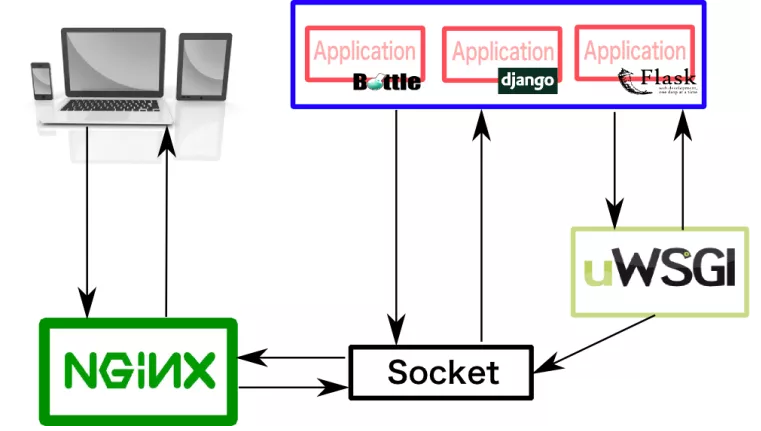
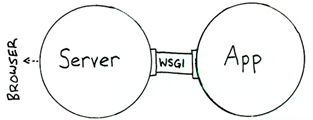

# ❖ 一文了解Python网络应用的技术架构 [DRAFT]

如果想了解基于Python的网络应用，除了知道Python语言以外，还必须要知道整条架构的技术栈。
Python的WebApp架构不是一气呵成的，而是在每个环节都要挑选一个合适的模块最终组合在一起才能发挥作用。

## 理解CGI

要理解Python的WSGI之前，先要了解什么是`CGI`，了解CGI在网络应用中的作用。

`CGI (Common Gateway Interface)`，常听说但不太明白。实际上一句话就可以概括：

> "CGI offers a standard protocol for web servers to execute programs that execute like console applications (also called command-line interface programs) running on a server that generates web pages dynamically. " -Wiki

也就是说，CGI的作用就是：**把HTTP Server接收到的请求，转换为本机上其它应用程序（如Shell命令行、Python、Java等）可以理解的命令。也就是说，让网页的互动像直接与本地程序互动一样简单。**

简而言之：
**CGI就是一个语言转换器。将网络语言转换为具体的各种程序语言。**

基于这个特性，CGI只是一个泛指。而针对不同的语言、程序，自然也就有不同的CGI来转换。
常见的CGI如下：
- 适于Python:
    - WSGI
    - mod_python
- 多语言适用：
    - FastCGI (Python, node.js, PHP, Ruby, Java, Go, C++, Lua ...)

## 理解WSGI: 针对Python的翻译机制

`WSGI (Web Server Gateway Interface)`，是一种Python官方(PEP 333)制定的一个网络交互规范：客户端 -> HTTP服务器 -> WSGI -> Application(Wordpress/Flask/Django)。反过来发送给客户端也是一样。

每个语言对于网络服务器的处理可能不一样：如同Ruby的Rack。Python使用`WSGI`，即一种通用的接口标准或者接口协议，实现了Python Web程序与服务器之间交互的通用性。

`WSGI`是将HTTP Server的参数进行`Python化`，封装为request对象传递给apllication命名的func对象并接受其传出的response参数，由于其处理了参数封装和结果解析，才有python世界web框架的泛滥，在python下，写web框架就像喝水一样简单。（参考：https://www.zhihu.com/question/19998865/answer/27033737）

有了这个东西，Flask或者Django等等的python web开发框架，就可以轻松地部署在不同的web server上了，不需要做任何特殊配置（也需要一些小小的配置调整）

> "如全称代表的那样，WSGI不是服务器，不是API，不是Python模块，更不是什么框架，而是一种服务器和客户端交互的接口规范."

在客户端向服务器发出请求时，HTTP Server服务器接收请求，进行socket、tcp、udp等基层操作，全部验证通过后，再把请求内容发给WSGI。然后WSGI作为一个Python关口，把请求数据全部转换为Python程序能理解的信息，再把这些信息发送给具体的某个app应用，比如Flask，或Django。这时候，Flask等框架接收到的，就是一般的Python化的数据了，而不是网络规范的数据。也就是说，Flask等框架，完全无需考虑Protocols网络协议等东西，专心做好自己的网站就好了。

## WSGI 组件
~在WSGI规范下，web组件被分成三类：client, server, and middleware.~

## 更新

WSGI：全称是Web Server Gateway Interface，是一种规范，描述web server如何与web application通信的规范。要实现WSGI协议，必须同实现web server和web application，当前运行在WSGI协议之上的web框架有Bottle, Flask, Django。

1. WSGI server：负责从客户端接收请求，将request转发给application，并将application返回的response返回给客户端，比如uWSGI和Gunicorn都是实现了WSGI server协议的服务器。
2. WSGI application：接收由server转发的request，处理请求，并将处理结果返回给server，比如Flask和Django都是实现了WSGI application协议的web框架。
3. 注：Flask和Django框架都有自己实现的简单的WSGI server，但一般只用于调试，生产环境下还是最好用其他WSGI server。
4. 反向代理：指的是用代理服务器来接受internet上的连接请求，然后将请求转发给内部网络上的服务器，并将从服务器上得到的结果返回给internet上请求连接的客户端。与正向代理不同，用户不知道真实的服务端，反向代理服务器会帮我们把请求转发到提供真实计算的服务器那里去。
整体架构
下图可以很直观地说明uWSGI（Server）、客户端（浏览器）、Flask应用（application）之间的关系。



## 网络应用技术栈的组合搭配

[参考：Web 应用 & 框架 (The Hitchhiker's Guid to Python)](https://pythonguidecn.readthedocs.io/zh/latest/scenarios/web.html)

可选方案有：
- Web Application Framework
    - Flask (轻量化)
    - Django (重量级傻瓜式)
    - Tornado (超级异步式)
    - Falcon (RESTful API搭建)
    - Pyramid
    - Masonite
- WSGI Server
    - Gunicorn (当前流行)
    - uWSGI
    - Waitress
- HTTP Server
    - Nginx (目前别无二选。)

在这些组件里面，一般从每一个大类里面挑一个具体的库，配合使用。具体怎么搭配就看自己需求了。

常用的组合有：
- Flask + Gunicorn + Nginx

实际上光Flask也是能上线运行的，但是它作为HTTP服务器的能力太有限了，所以需要搭配别的模块使用。具体来讲就是：
- Flask直接运行App，生成HTTP服务器，但只能同时处理一个请求，两个请求并发就不行了。
- 通过Gunicorn来启动Flask的App，就能允许多个App的`线程`同时运行、处理请求。
- Nginx能够把Gunicorn的端口隐藏起来，甚至通过负载均衡将请求转发到多个服务器的Gunicorn上。

从这里可以看到，其实这个组合不是必须的，拆掉哪个都能用。只是一个健全的网络App，这样处理是必要的。试想，同一时间只能接受一个人访问的网站，也算网站吗？再想，有客户会在URL网址里输入端口号去访问网站吗？

