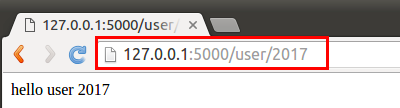
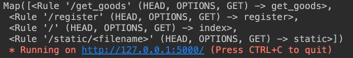
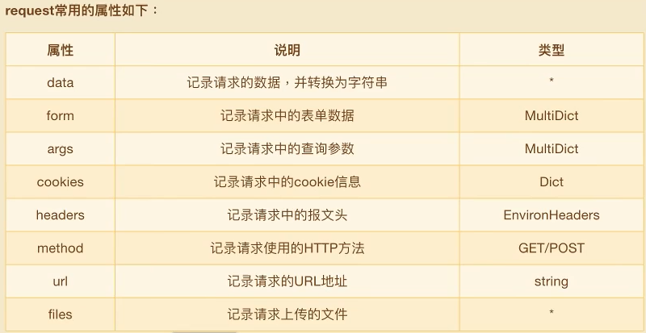

# ❖ 一篇文章入门Flask

Flask本身相当于一个内核，其他几乎所有的功能都要用到扩展（邮件扩展Flask-Mail，用户认证Flask-Login），都需要用第三方的扩展来实现。

Flask对WSGI (路由)的实现，是采用 Werkzeug，而模板引擎(业务视图) 则使用 Jinja2。这两个是Flask框架的核心。

Flask核心就是作为一个Webapp框架的两个基础部分：
- CGI (WSGI) 路由：是由Werkzeug实现，即将网络请求翻译成Python语言
- Template 业务模版：是由Python流行的Jinja2实现

除此之外，Flask其它一切的都是由第三方插件实现：
包括：
> Flask-SQLalchemy：操作数据库； Flask-migrate：管理迁移数据库； Flask-Mail:邮件； Flask-WTF：表单； Flask-Bable：提供国际化和本地化支持，翻译； Flask-script：插入脚本； Flask-Login：认证用户状态； Flask-OpenID：认证； Flask-RESTful：开发REST API的工具； Flask-Bootstrap：集成前端Twitter Bootstrap框架； Flask-Moment：本地化日期和时间； Flask-Admin：简单而可扩展的管理接口的框架

参考Flask扩展列表：http://flask.pocoo.org/extensions/

## Flask安装

安装很简单：
```sh
$ pip install flask
```

建议在Virtualenv虚拟环境下安装，因为Flask需要一系列的依赖，最好给Flask生成一个专用的生产环境，并生产`requirement.txt`依赖列表：
```sh
# 生产虚拟环境
$ virtualenv ./flask_env
# 启动虚拟环境
$ ./flask_env/bin/active
# 生产依赖列表
$ pip freeze > requirements.txt
```

## Hello World

一个最简单的Flask程序，只需要三步：
- 生成Flask类的实例，即一个APP
- 指定目录的`路由规则`，即不同路径可以实现不同的操作。
- 运行app：`app.run()`

，`hello-world.py`：
```py
from flask import Flask

# 生产一个Flask APP 实例，并指向当前文件(模块)
app = Flask(__name__)

# 指定"／"根目录的路由规则
@app.route('/')
def index():
    return 'Hello World'

# 开始运行app
app.run()
```

Flask中，路由的实现是用装饰器:`@app.route("/")`这种方式来做到的。


## Flask路由规则

页面显示指定内容：
```py
@app.route('/')
def index():
    return '<h1> 欢迎访问此页面 </h1>'
```

页面返回指定内容、状态码、headers等：
```py
@app.route('/')
def index():
    body = '<h1> 欢迎访问此页面 </h1>'
    status_code = 200
    headers = {'Cache-Control':'no-cache', 'Connection':'keep-alive'}
    return body, status_code, headers
```


指定接收的`请求方式`：
```py
@app.route('/', method='GET')
# ...
```

给路由传参数：
```py
@app.route('/orders/<order_id>')
def hello_itheima(order_id):
    return 'The ID of order is: %d' % order_id
```

限制路由参数的数据类型：
```py
@app.route('/orders/<int:order_id>')
# ...
```
其中`int:order_id`是指定参数`order_id`必须能转换成int整数，否则这个请求就会自动被拒绝。
比如用户请求`http://xyz.com/orders/HAHAHAH`，这就不成功。而`http://xyz.com/orders/210`这样的就成功。



中断请求：
```py
# ...

from flask import abort

@app.route('/wrong-page')
def hello():
    # 中断请求，并返回404状态码
    abort(404)
```

处理错误请求：
```py
# ...

@app.errorhandler(404)
def handel_404_error():
    return '<h1> The page does not exist </h1>'
```
其中，如果路由中调用了`abort(404)`中断函数，或是其它产生404错误的方法，这个`app.errorhandler`都会被自动调用。


返回“渲染”过的模版（即把动态的模版渲染成静态的HTML）：
```py
#...
from flask import render_template

@app.route('/')
def index():
    return render_template('index.html')
```


## Flask 路由分割

如果所有路径的路由都定义在一个文件里，会很难维护，所以必定要把各个路径的路由分拆到不同的文件里。

这种分拆很简单：

正常情况下，在`index.py`主模块中，我们还是一样正常的定义路由：
```py
#...
@app.route('/')
def index():
   pass
```
然后我们可以把其它路由的处理函数分别放在别的文件里，比如：
`register.py`中定义“普通函数”：
```py
def reg():
    pass
```
以及`login.py`中定义一个普通函数：
```py
def signin():
    pass
```

然后回到主模块`index.py`中，我们可以导入这些函数，并显式的将这些函数注册到路由上：
```py
from flask import Flask

from register import reg
from login import signin

app = Flask(__name__)

app.route('/register')(reg)
app.route('/login')(signin)

@app.route('/')
def index():
    pass
```

然后我们可以用`app.url_map`获得当前定义过的所有路由：
```py
print( app.url_map )
```



## Flask Blueprint 蓝图


我们手动分割路由处理函数，然后分别导入，这样虽然也简单，但是不不好的地方是，主模块外定义的各个处理函数，本身很难看出来处理的是什么路由逻辑。

为此，Flask提供了另一种`路由分割`的方法：即`Blueprint`类。
而这个Blueprint类生成的对象，是在子模块中代替了之前我们所使用的`Flask`类生成的app对象。
也就是说：主模块还是用app，但是子模块中用蓝图blueprint。


假设我们现在有一个子模块`order.py`定义`"/order"`路径的路由，那么文件中定义如下：
```py
from flask import Blueprint

# 生成蓝图实例：参数中一个是蓝图名称，一个是主模块名称
app_orders = Bluepint('blueprint_orders', __name__)

# 将路由添加到蓝图里
@app_orders.route('/orders')
def get_orders():
    pass
```

然后回到主模块`index.py`中，把蓝图注册到主路由上：
```py
#...
from orders import app_orders

app = Flask(__name__)

app.register_blueprint( app_orders )

#...
```


## Hooks 钩子事件

Flask提供一个完整请求至回应的事件流，其中包括：
- `@app.before_first_request`: 接受第一次请求之前执行
- `@app.before_request`: 接受请求前，每次请求之前都执行。
- `@app.route()`: 处理请求
- `@app.after_request`: 请求之后执行，但前提是请求中没有出现异常
-`@app.teardown_request`:  关闭请求时，即每次请求是否异常都会被执行

以下是钩子的用法：
```py
#...

@app.before_first_request
def handle_before_first_request():
    pass

@app.route('/')
def index():
    pass

@app....
def ...
```


## Flask上下文请求对象 flask.current_app

`request.current_app` 是Flask特有的一种`request请求处理`方式，不同于`flask.request`对象的处理方式，它是能区分多个请求的。

在我们常用的`flask.request`对象中，会有一个很严重的问题：即它是一个`全局变量`。也就是说，如果服务器在处理并发请求时使用的是在同一个进程里的多线程，那么不同用户的请求也许会使用同一个`flask.request`对象！这时候request中的请求信息就会出现混淆！

所以Flask引入了`request.current_app`这个对象，即它能够根据上下文来区分不同人的请求。
这是怎么做到的呢？其实很简单，它只是把request变为一个`局部变量`而已。这样一来，每次的request请求，都是各自独立的局部对象。


## 返回响应信息 flask.make_response

除了我们自己定义返回的信息外，Flask提供了一个内置的`make_response`对象，便于处理返回信息。

返回全文信息：
```py
from flask import make_response

@app.route('/')
def index():
    resp = make_response('<h1> 欢迎访问此页面 </h1>')
    resp.status = 200
    resp.headers['Cache-Control'] = 'no-cache'
    return resp
```

设置cookies：
```py
from flask import make_response

@app.route('/')
def index():
    resp = make_response('<h1> 此页面会设置你的cookies :) </h1>')
    resp.set_cookie('uuid', '1230sfjdlsj3uu')
    resp.set_cookie('name', 'Jason', max_age=360)
    return resp
```
其中，`max_age`是cookie的存活时间，以s秒为单位。不设置的话，默认是`临时cookies`，即浏览器关闭后立马失效。

删除cookie：`resp.delete_cookie('uuid')`。注意，这里的删除并不是立马删除浏览器中用户的cookie，而只是把`max_age`设置为0，即浏览器关闭后立马失效。


## 获取请求信息 flask.request

Flask中有一个request对象，接收了一切对当前模块的请求数据。
使用的话，直接在`@app.route`后面的函数中用`def index(request)`接收来自装饰器的请求对象即可使用。

request参数类型：




常用的各种类型操作如下：
```py
from flask import request 
app = Flask(__name__)

@app.route('/', method='POST')
def index(request):
    # Get uploaded file
    afile = request.files.get('pic')
    with open('./pic.jpg', 'w') as f:
        f.write( afile.read() )

    # Get a form
    form = request.from    # Dict类型
    name = form.get('name')
    age = form.get('age')

    # Get cookies
    uuid = request.cookies.get('uuid')
    name = request.cookies.get('name')
```


## 会话处理 flask.session

在登录页设置session，并在index页根据session判断是否登录：
```py
from flask import session
#...

app.config['SECRET_KEY'] = 'asdlkjflaj23jrsdjf任意字符串作为密钥kaljdsl;fkja;j'

@app.route('/login')
def login():
    # 设置sessions
    session['uuid'] = '123abadsf'
    return '<p> 登录成功 </p>'

@app.route('/')
def index():
    # 获取sessions
    uuid = session['uuid']
    # 判别session是否存在
    if uuid:
        return '<p> 之前已登录过 </p>'
    else:
        return '<p> 未登录，请重新登录 </p>'
```
其中，Flask默认情况下，会利用`app.config['SECRET_KEY'] `的值作为一个密钥，来加密你手动设置的session，然后把这个信息转换为名叫`session`的cookie存在浏览器中。
这个是Flask特别的一点。

但是把敏感的session数据保存到谁都能访问的cookie中，即使加密了也不是很安全。
所以一般我们还是会手动把session数据存到服务器后台的数据库中，而不是存到cookie中。
每次验证再与数据库进行对比。


## 表单处理 request.form

动态网页必须要的就是Form表单。Flask中有自带的form表单处理方法。不过我们也可以用第三方插件`Flask-WTF`实现。

这里我们先只讲自带的处理方式。

### Flask自带表单处理

假设我们有一个表单模版`form.html`：
```jinja2
<form method="post">

    用户名：<input type="text" name="username">
    密码: <input type="password" name="password">
    确认密码: <input type="password" name="password2">

    <input type="submit" value="提交"><br>

    
        {{ message }}
    
    
</form>
```

当用户点击submit提交时，
整个form信息就会用POST方式提交到Flask的路由文件`abc.py`中。
我们进行处理如下：
```py
from flask import Flask
from flask import render_template
from flask import request

app.secret_key = 'abc123'

@app.route('/', methods=['GET', 'POST'])
def hello():

    if request.method == 'POST':

        # 获取参数, 并效验参数完整性, 如果有问题就进行flash
        username = request.form.get('username')
        password = request.form.get('password')
        password2 = request.form.get('password2')

        if not all([username, password, password2]):
            flash('params error')
        elif password != password2:
            flash('password error')
        else:
            print username
            return 'success'

    return render_template('Congratulations.html')
```


## Flask的HTTP Server

一般我们在开发调试过程中，可以用Flask自带的WSGI和一个小HTTP Server来实现整个App正常运转。
但是生产环境中，这两个自带的组件就效率很低了。所以我们需要用效率更高的独立的CGI和独立的HTTP Server服务器来部署真正的生产环境

一般常见的选项有：
- HTTP Server -> 首推Nginx
- CGI翻译器 -> Gunicorn (Python开发，实现了WSGI翻译)

所以，我们一般采用`Nginx + Gunicorn + Flask`来部署网络应用。


Gunicorn的使用：
```py
# 安装
$ pip install gunicorn

# 进入Flask app的主目录
cd ./myFlask

# 用gunicorn服务器启动Flask app
$ gunicorn -w 4 -b 127.0.0.1:8080 main:app
```
这个时候，flask就在gunicorn的HTTP服务器上运行了，可以通过127.0.0.1:8080访问到app。
