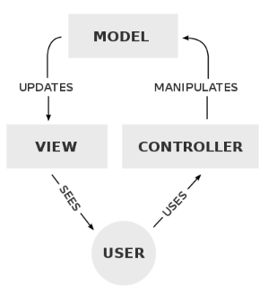
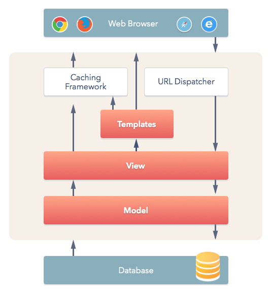
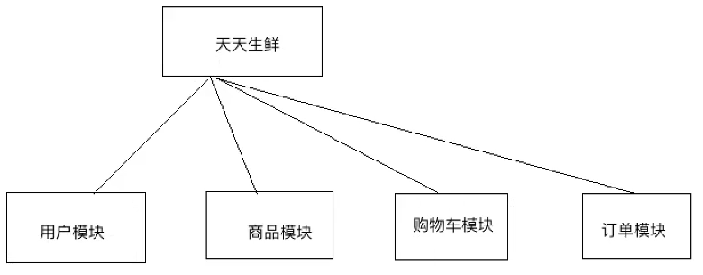
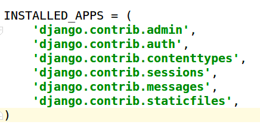
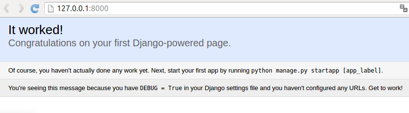

# 一篇文章入门Django框架 [DRAFT]


## MVC／MVT 框架

> **`MVC`是一种编写代码的逻辑上的分割模型，即把代码分为三大部分：M、V、C，每部分明确的负责一个层面。这样的作用是什么？那就是为了日后更方便的代码维护、代码迁移和代码重构等。**

[参考Wiki：Model–view–controller](https://www.wikiwand.com/en/Model%E2%80%93view%E2%80%93controller)

传统的MVC（Model-View-Control)模型适用于大多数的桌面App和网络App的程序编写。
即`Model模型`(负责数据库) -> `View视图`(负责将数据显示为最终界面) -> `Controller控制器`(负责将用户请求转化为界面或数据库的改动)。





> Django的代码结构是典型的MVC框架。只是具体实施上，它把视图View作为一个Router路由来负责不同URL映射到不同的处理方法，然后用Template模版来作为动态显示，所以也叫MVT模型。（其实这么叫非常不准确，所以提到MVT的人不多）



> 注意：网路上对MVC和MVT的说法、图解都各有不一，因为很多人对这些叫法和结构都产生了混淆。所以不能太依赖各种非官方的文章和图片。


了解Django的这种“代码结构”有什么作用？
因为Django是一个以及成熟开发的网络App，我们要做的只是改一改具体业务信息即可。正因为他是已经完整开发的App，所以我们要清楚他开发的结构是什么，**才知道哪种需求到哪里去改。**


## ORM模型

`Object-Relations-Mappings`，实际上是`Object -> Mappings -> Relations`这种方向，即：

**把业务抽象为程序中的`Object对象`，然后通过一种`Mappings方法`，映射为`Relational数据库`的表格中去。**

简而言之，ORM实际上是一种`操作数据库的模型`，或是`一套操作数据库的方法`。

Django中提供了一套完善的ORM模型，即一个工具包，让你轻松把自己创建的业务对象和数据库里的表格对应起来，随便操作。


## 安装

建议在虚拟环境中，且为django项目独立创建：
```sh
$ pip install django
```

## 创建Django项目

```sh
$ django-admin startproject ./MyDjangoProject
```

创建好Django项目后，文件夹中会出现如下目录结构：
- `./MyDjangoProject`
    - `manage.py`：整个项目的管理文件
    - `MyDjangoProject`：整个项目文件
        - `__init__.py`
        - `setting.py`：项目配置文件
        - `urls.py`：网址的路由设置，不同路径分配不同的处理函数
        - `wsgi.py`：作为Web Server，并负责和Django框架进行交互

> 注意：Django中，一个项目只是一个Admin管理员，不包括任何的具体实现。真正的业务代码实现，也就是具体的MVC实现，是要在单独的各个模块中的。

## Django的模块分割

Django中的一个项目只是代表一个大框架，不同于Flask创建一个项目即一个完整的app。

**Django中的一个app只是大框架下的一个子模块。Django中的每个app都具备完全的MVC结构代码。**




实际工作中，在我们设计好`业务模块`后，就可以在Django中把模块分开： **一个模块生成一个子目录，即一个`app`应用。** 每个app子文件夹都有同样的一套文件，实现了典型MVC代码分割。

在一个Django项目中，创建一个子app应用的命令为：
```sh
$ python ./manage.py startapp MyApp01
```
创建好子app的MyApp01后，Django的目录中就出现了一个子目录`MyApp01`，结构如下：
- `./MyApp01`
    - `admin.py`：网址后台Dashboard相关
    - `__init__.py`：
    - `migrations/`
        - `__init__.py`
    - `models.py`：MVC中的M，负责和数据库交互
    - `tests.py`：测试代码
    - `views.py`：MVC中的V，负责页面的模版


**建立好各个模块后，我们需要在项目主配置`settings.py`中把每个模块进行注册，才能集合为一个项目。**

在`settings.py`中注册的方法如下：




启动服务器：
```py
$ python ./manage.py runserver IP:端口
```

然后就会启动一个指定IP的服务器：



