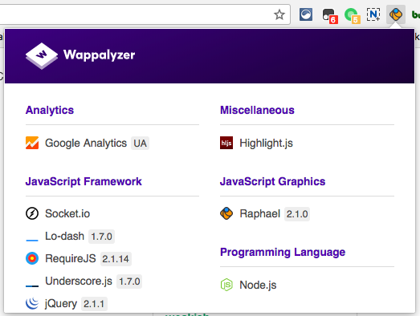
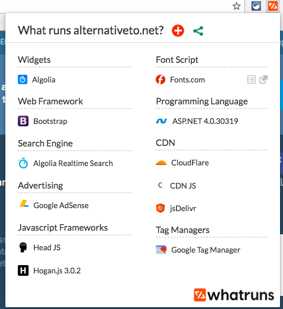
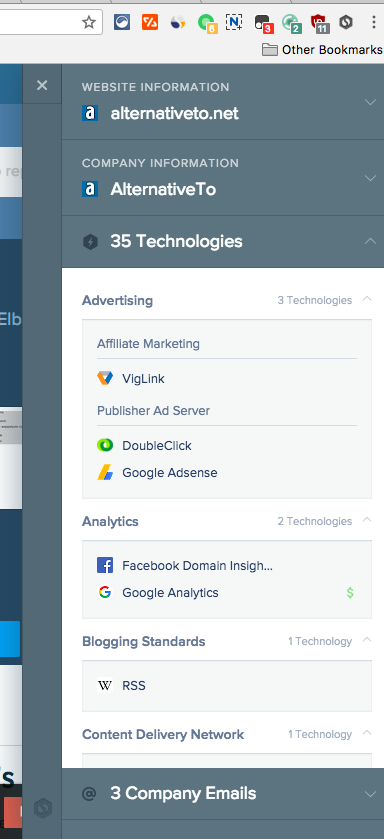
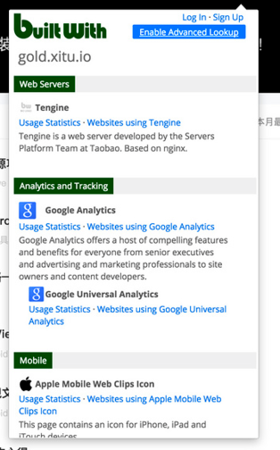
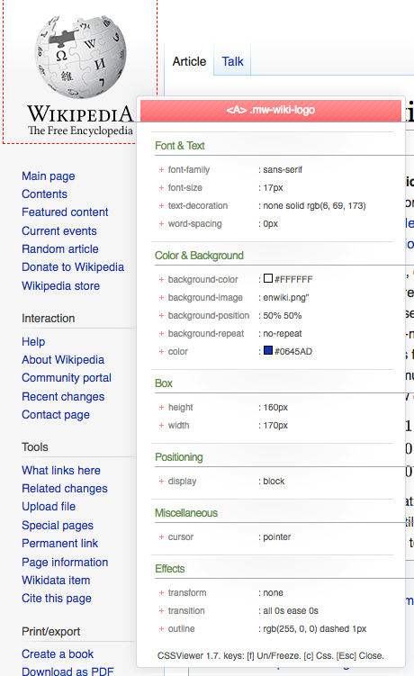
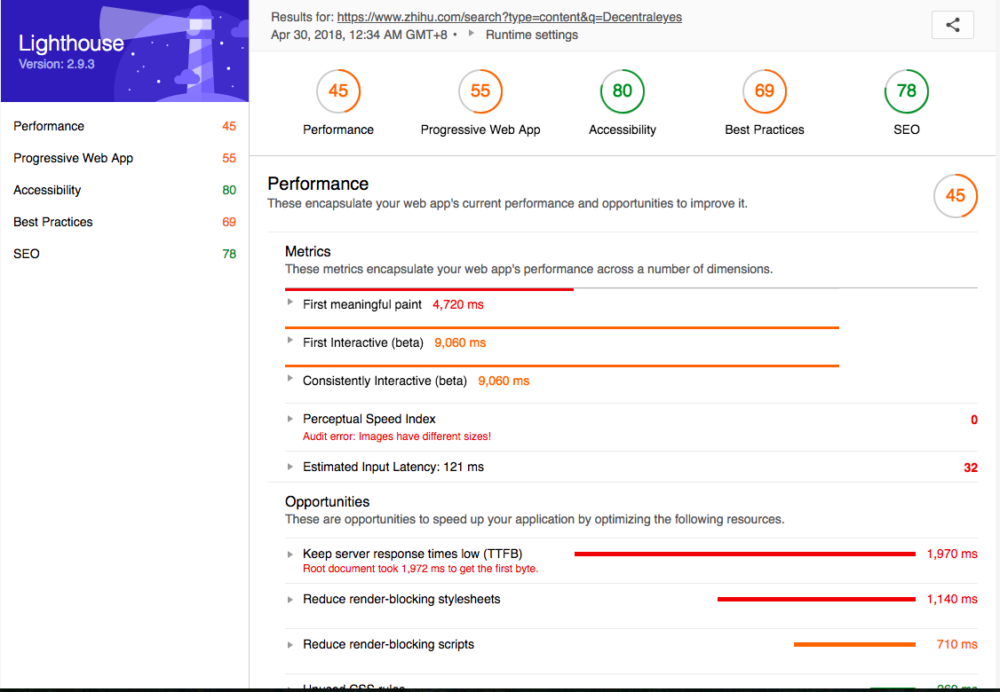
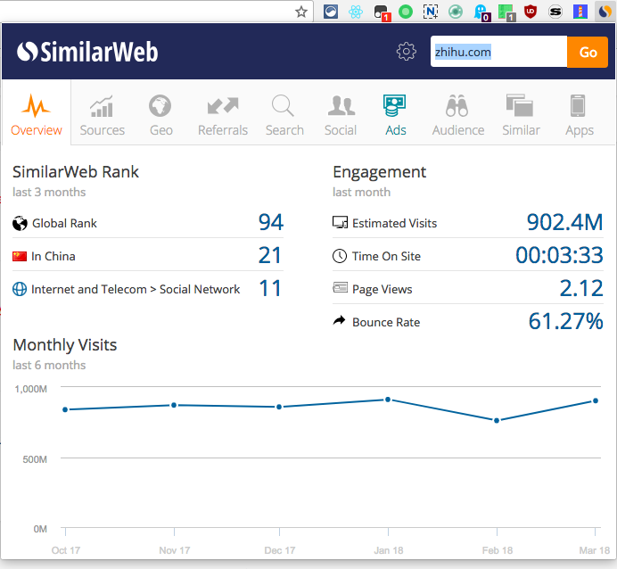
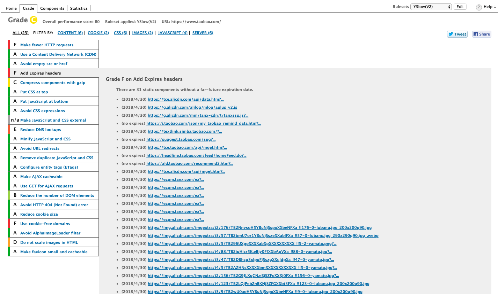

# ❖ Chrome开发者插件合集：网站技术栈检测

类别：`Web Dev Tools`
作用：显示当前网站的技术栈组成

## Wappalyzer

[`Wappalyzer`](https://chrome.google.com/webstore/detail/wappalyzer/gppongmhjkpfnbhagpmjfkannfbllamg?hl=en)
> 分类显示清晰好看，速度快（与网页一起加载）。但是长期占用200M以上内存。

## WhatRuns

[`WhatRuns`](https://chrome.google.com/webstore/detail/whatruns/cmkdbmfndkfgebldhnkbfhlneefdaaip?hl=en)
> 占用内存小，但是需要临时检测，所以要等待出结果。界面好看。

## SimilarTech Prospecting

[`SimilarTech Prospecting`](https://chrome.google.com/webstore/detail/similartech-prospecting/jiabgmelnfhgjkfdaoiccfcbaedjfcnm/related?hl=fil)
> 临时加载，但是信息非常非常全面。非弹出窗口，而是在网页中加载一个竖条，失去焦点后不会消失，很方便。比较慢，但是信息全，分类方便看。

## BuiltWith Technology Profiler

[`BuiltWith Technology Profiler`](https://chrome.google.com/webstore/detail/builtwith-technology-prof/dapjbgnjinbpoindlpdmhochffioedbn?hl=en)
> 速度慢，css样式还经常加载不出来。还显示好多不太用得到的东西和连接，把内容弄的很长让你去翻页看。

## CSSViewer

[`CSSViewer`](https://chrome.google.com/webstore/detail/cssviewer/ggfgijbpiheegefliciemofobhmofgce)

鼠标放在哪，就显示哪的css样式。按ESC取消。

## Lighthouse

[`Lighthouse` ](https://chrome.google.com/webstore/detail/lighthouse/blipmdconlkpinefehnmjammfjpmpbjk)
> Reports on how the webpage loaded.
用时长，检测单个网页，然后单独弹出一个网页显示报告结果。显示清晰，结果分类详细
展示很容易看。信息很有价值。

## SimilarWeb

[`SimilarWeb`](https://chrome.google.com/webstore/detail/similarweb-traffic-rank-w/hoklmmgfnpapgjgcpechhaamimifchmp)
> 超详细检测当前网站的类似网站、被引用情况、SEO信息、用户分类统计等。超详细超有料！

## YSlow

[`YSlow`](https://chrome.google.com/webstore/detail/yslow/ninejjcohidippngpapiilnmkgllmakh) - 网页加载检测报告
> YSlow analyzes web pages and suggests ways to improve their performance based on a set of rules for high performance web pages.
网页加载检测报告。非常详细，但是报告排版不是很容易看懂。比Lighthouse快

