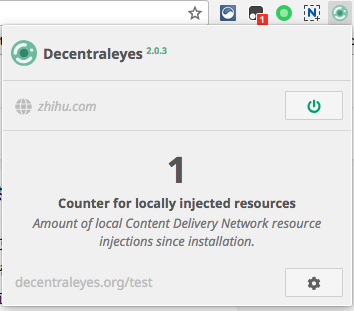
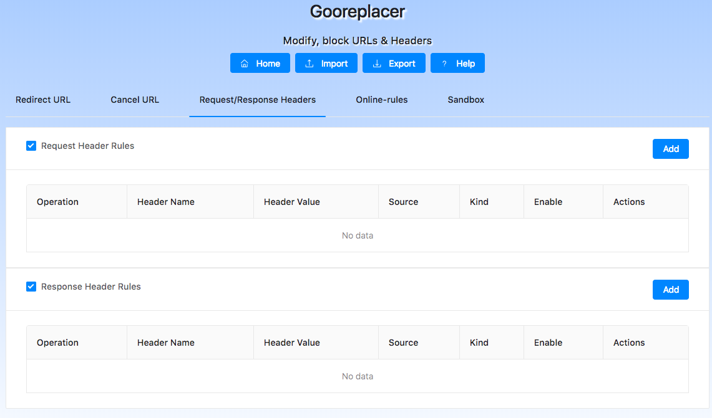
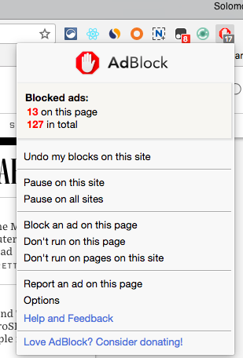
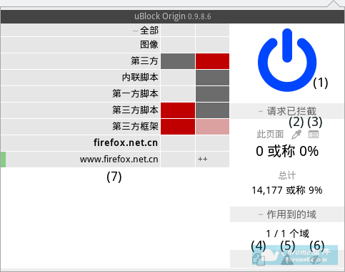
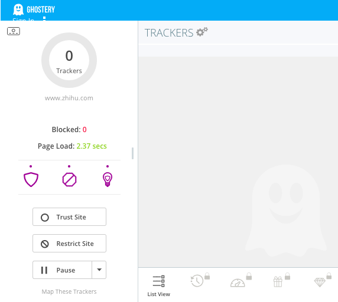

# ❖ Chrome开发者插件合集：网页加载优化

## Decentraleyes

[`Decentraleyes`](https://chrome.google.com/webstore/detail/decentraleyes/ldpochfccmkkmhdbclfhpagapcfdljkj)

> 通过加载本地其事先加载好的资源，并拦截其他第三方的资源请求来加快网页加载速度，该插件还能在加快网页加载速度的同时还能减少一些跟踪脚本的跟踪功能以使得你的网络环境更加安全。

[参考文章](http://chromecj.com/productivity/2017-12/854.html)

## Gooreplacer

[`Gooreplacer`](https://chrome.google.com/webstore/detail/gooreplacer/jnlkjeecojckkigmchmfoigphmgkgbip)

> 重定向/屏蔽 URL，修改/删除 headers. gooreplacer 最初为解决国内无法访问 Google 资源（Ajax、API等）导致页面加载速度巨慢而生，新版在此基础上，增加了更多实用功能，可以方便用户屏蔽某些请求，修改 HTTP 请求/响应 的 headers。

[中文官方介绍](https://github.com/jiacai2050/gooreplacer)
[使用语法指南](https://github.com/jiacai2050/gooreplacer/blob/master/doc/guides.md)

## AdBlock

[`AdBlock`](https://chrome.google.com/webstore/detail/adblock/gighmmpiobklfepjocnamgkkbiglidom)
> The most popular Chrome extension, with over 40 million users! Blocks ads all over the web.

ABP 不管是什么网页都会插入 14000 多条元素隐藏规则，所以占用内存很大.

## uBlock Origin

[`uBlock Origin`](https://chrome.google.com/webstore/detail/ublock-origin/cjpalhdlnbpafiamejdnhcphjbkeiagm)

> uBlock Origin对比ABP有性能上的优势，其最为突然的性能优势就是其占用极低的内存和 CPU。有分析说adp主要靠的是屏蔽，而ublock Origin主要靠的是阻断，ABP的工作需要在所有网页插入屏蔽脚本和css，而uBlock Origin直接阻止需要屏蔽的内容进入当前网页。一般的拦截请求的规则大家都差不多，关键的是元素隐藏规则，uBlock 把它叫做修饰规则 cosmetic filters，ABP 不管是什么网页都会插入 14000 多条元素隐藏规则，所以占用内存很大，uBlock 插入的很少，因为他是在网页开始加载以后才判断需要用到哪些元素隐藏规则。所以才在性能上面要更加优越。

[AdBlock 对比 uBlock Origin](https://zhuanlan.zhihu.com/p/23188485)
[参考使用方法文章](https://www.jianshu.com/p/22a73602c2ed)

### 使用方法

[参考文章： uBlock Origin：不仅可以过滤广告还可以创建过滤规则屏蔽任何你不想见的元素](http://chromecj.com/productivity/2017-06/770.html)
(1)关闭按钮，用于关闭uBlock按钮，蓝色开启/灰色关闭 
(2)元素吸管，屏蔽元素按钮(用过ABP的都知道) 
(3)网络请求日志(个人理解:网络请求记录监控中心)：可以按照网络资源查看/屏蔽的控制系统 
网络请求日志与开发工具的网络 不同之处在于，不单单可以查看网络资源，还可以屏蔽不想要的脚本等等之流 
(4)禁止网页弹窗按钮，开启后，该网页永久无法弹窗 
(5)严格屏蔽按钮，开启后，将不再对当前网页本身进行屏蔽，比如可以用于网络运营商的网络劫持，规则(uBlock设置->自定义规则列表)：

### uBlock Origin 常用设置

[参考：uBlock Origin中文使用手册，告诉你uBlock Origin怎么用！](https://blog.csdn.net/jamie0515/article/details/76522036)

打开后台设置选项：
对于中文规则：
- CHN: CJX's EasyList Lite​
- CHN: CJX's Annoyance List​​
- CHN: EasyList China (中文)​
对于英文规则：
- EasyList​

注意：启用越多的过滤规则就会产生越高的内存占用。 然而，即使再添加，uBlock₀ 的内存占用依然比其他常见的过滤工具要低的多。

## Ghostery

[`Ghostery`](https://chrome.google.com/webstore/detail/ghostery-%E2%80%93-privacy-ad-blo/mlomiejdfkolichcflejclcbmpeaniij) - Privacy Ad Blocker

> Ghostery’s built-in ad blocker removes advertisements from a webpage to eliminate clutter so you can focus on the content you want.
Protect your privacy
Ghostery allows you to view and block trackers on websites you browse to control who collects your data. Enhanced Anti Tracking also anonymizes your data to further protect your privacy.
Browse faster
Ghostery’s Smart Blocking feature speeds up page loads and optimizes page performance by automatically blocking and unblocking trackers to meet page quality criteria.
Customize your display
Ghostery offers multiple displays and insights dashboards so you can see the information that’s relevant to you.

