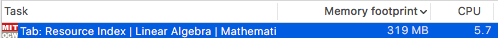
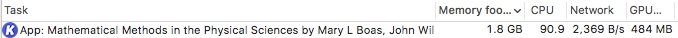

# 迷之网页占用资源

## MIT OCW

[跳转至该网页：MIT OCW Linear Algebra 18.06sc](https://ocw.mit.edu/courses/mathematics/18-06sc-linear-algebra-fall-2011/resource-index/)

> 明明就是一个静态网页，加载时半分钟都是CPU占用100%，加载完毕后300M以上的内存占用。

## Kami PDF editor for Chrome

