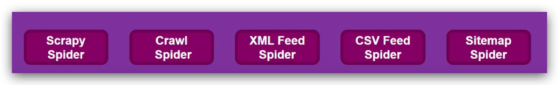
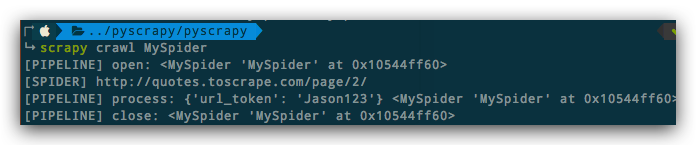

# ❖ Scrapy 入门 [DRAFT]


## 理解Scrapy流程

`Spider` -> `item` -> `Pipline`

其中：
- `Spider`只负责向目标网站，获得response，传给item
- `item`只负责从response中整理数据，变成item字典对象，传给pipline
- `Pipline`只负责把item字典对象转换为ORM，保存到数据库


## Settings 通用设定

Logging:
```py
LOG_LEVEL = 'INFO'  # DEBUG/INFO/ERROR/CRITICAL
LOG_FORMAT = '%(levelname)s: %(message)s'
```

禁止cookies, 防止因为cookies不合格而被发现：
```py
COOKIES_ENABLED = False
```


Robot协议遵守（推荐: 不遵守）：
```py
ROBOTSTXT_OBEY = False

```

随机User-Agent:
```py

```


随机Proxy:
```py

```


## Spider爬虫


### 爬虫类型

为了适合各种不同的爬取需求，Scrapy提供了对应各种情况的不同`爬虫基础类`。

[参考官方文档Scrapy：Spiders](https://scrapy.readthedocs.io/en/latest/topics/spiders.html)



其中各自的特点是：
- `Scrapy Spider`: 所有爬虫的基础类。一般用于自定义爬虫来继承，定制性强。
- `Crawl Spider`：通用型爬虫。适合抓取页面所有链接，可以定制`Rule`筛选链接
- `XML Feed Spider`：XML数据爬虫。自带XML解析
- `CSV Feed Spider`：CSV数据爬虫。自带分隔符判断等
- `Sitemap Spider`：Sitemap爬虫


### Parse()函数的本质及多重yield

Spider类中的`parse()`函数，本质上是一个Generator生成器。然后Scrapy引擎会不断的调用这个生成器，把获得的`response`传送给下一步骤的Pipline.

`parse()`中很常见多个`yield`，或一个`return`，或什么都没有。这代表了你可以根据自己选择，让它不断`递归挖掘信息`，或一次性返回一个结果，或者什么都不返回，直接输出写入文件。

另外，`parse()`的返回值类型也不是固定的，目前我们可以返回这两种类型：
- `scrapy.item`对象：如果直接返回item，那么这个item会直接传送到pipline进行下一步处理。
- `scrapy.Request`对象：如果返回的是Request对象，那么引擎会再次发送Request请求，递归回本函数。

我们常见在`parse()`中写两个yield语句，返回两种不同类型的对象，如下：
```py
def parse(self, response):
    #do something
    #item[key] = value
    yield item
    yield scrapy.Request(url, callback=self.parse)
```

这个不好理解。因为一般return的逻辑是统一返回一种东西。但其实只要了解yield就知道，引擎调用`parse()`，获得一个对象，根据它的类型做不同处理。处理完了再调用`parse()`，看这次又给我什么对象，我再处理。然后再调用。

把脑袋中的`return`逻辑忘掉，想想`yield`逻辑，就容易理解了。

如果能够理解yield的逻辑，那么我们就可以在`parse()`函数中玩出花了：
我们可以`for循环yield`，可以`递归yield`，可以一个一个手动yield。总之不管yield"吐出“什么东西，引擎都会接住，然后处理吐出的这个东西。处理完了再让你接着yield。


## Item对象

`scrapy.Item`对象，在爬虫中可有可无。如果你有需求把获得的数据转换为ORM进行数据库保存的话，这个很方便。但是没有，也不会影响爬虫运行。

> 关于item对象的名字，也是随便起，没有规则。因为最后是在`spider`类中被手动调用生成实例的，引擎不会参与。

如果需要ORM处理的话，就可以继承`scrapy.Item`对象。内容极其简单：只要定义几个类属性（字段）即可，连字段类型都不用填。

```py
import scrapy
 
class MyItem(scrapy.Item):

    username = scrapy.Field()
    description = scrapy.Field()
```


## Pipeline对象

`Pipeline`**不需要**继承scrapy的什么基础类，而是直接写即可。
但是爬虫引擎怎么发现这个类呢？——通过在`settings.py`中注册自定义`pipeline`的名称，然后引擎会自动调用这个类的`某几个固定的函数名`，传入相应的参数。

注意：`pipeline`不是只有在爬虫的request请求后才会被调用，而是根据自己的需要在spider开始前、结束后都可以被调用。

```py
# pipelines.py
class GoodPipeline(object):

    def open_spider(self, spider):
        print('[PIPELINE] open:', spider)

    def process_item(self, item, spider):
        print('[PIPELINE] process:', item, spider)
        return item

    def close_spider(self, spider):
        print('[PIPELINE] close:', spider)

```

然后在`settings.py`中注册这个pipeline：
```py
ITEM_PIPELINES = {
    'MyProject.pipelines.MyProjectPipeline': 300,
    'MyProject.pipelines.GoodPipeline': 400,
}
```
其中后面的`300, 400`这些是优先级的表示，数字越小越优先执行这个pipeline。


从下面这个执行结果，我们可以看到Pipline中定义函数的执行顺序：




上面我们看到在pipeline对象中我们写了`process_item()`函数，实际上还有其它固定名称的函数可以写。
这些固定函数如下：
- `process_item(self, item, spider)`
- `open_spider(self, spider)`
- `close_spider(self, spider)`
- `from_crawler(cls, crawler)`

