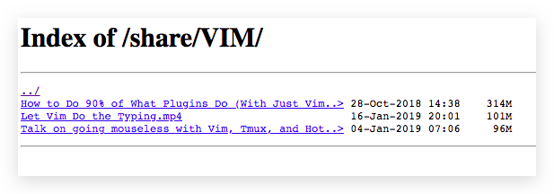

# Nginx 部署文件服务器

如果只为了分享，而不需要另一方写入文件，那么Nginx的文件服务比SMB或Webdav靠谱更多。

> 可以直接点开视频看，也可以直接点开图片。

```conf
http {
    server {
        listen       8080;
        server_name  localhost;

        location / {
             root   /var/www/html;
             index  index.html index.html;
        }

        location /share {
            alias   /path/to/shared-folder;
            autoindex on;  # Turn on file-server
            autoindex_exact_size off;  # Turn off to show human readable size
            autoindex_localtime on;
        }
    }
}
```




