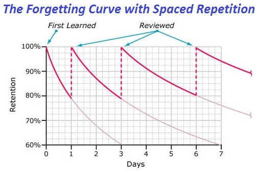
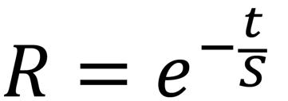

# 遗忘曲线（Forgetting curve）
> 也叫`艾宾浩斯遗忘曲线` (Ebbinghaus Forgetting curve).

[参考维基百科](https://zh.wikipedia.org/wiki/%E9%81%97%E5%BF%98%E6%9B%B2%E7%BA%BF)

```
20分后，42%被遗忘掉，58%被记住。
1小时后，56%被遗忘掉，44%被记住。
1天后，74%被遗忘掉，26%被记住。
1周后，77%被遗忘掉，23%被记住。
1个月后，79%被遗忘掉，21%被记住。
```

## 复习周期
1． 第一个记忆周期：5分钟
2． 第二个记忆周期：30分钟
3． 第三个记忆周期：12小时
4． 第四个记忆周期：1天
5． 第五个记忆周期：2天
6． 第六个记忆周期：4天
7． 第七个记忆周期：7天
8． 第八个记忆周期：15天



## 公式


