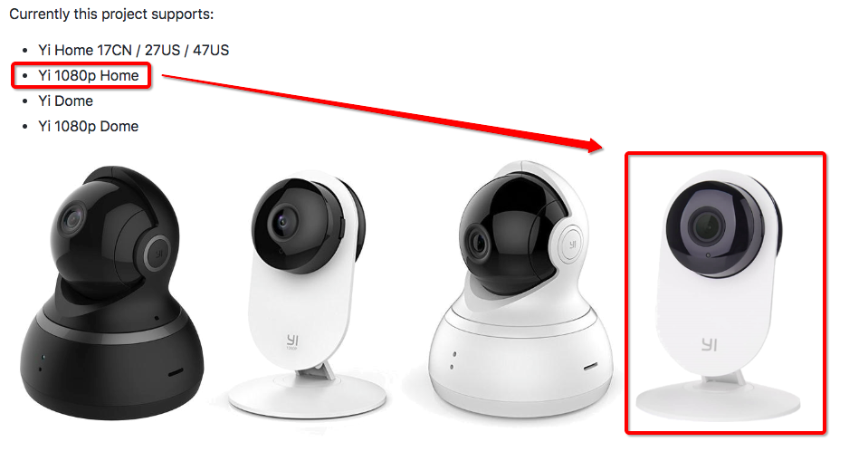
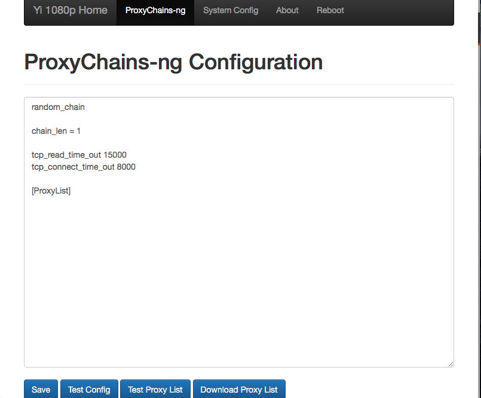

#  ❖ 小蚁1080P智能摄像机2 固件破解

> 这一款的英文名叫`Yi 1080p Home`。

这个摄像头非常好用，所以想到要破解，在上面安装SSH和流媒体直播功能。

主要使用了Gihutb上的一个破解。
[参考Github：shadow-1/yi-hack-v3](https://github.com/shadow-1/yi-hack-v3#getting-started---step-by-step-guide)
[参考Home Assistant的中文说明：小蚁摄像头Hack](https://home-assistant.cc/component/xiaomi/camera/#hack)

方法：
- 先到[这个链接](https://github.com/shadow-1/yi-hack-v3/releases)下载2个破解固件：`rootfs_y20`和`home_y20`
- 把两个文件直接保存到摄像头的SD卡上（SD卡必须是FAT32格式）
- 把SD卡插到摄像头上（关机状态），然后插电开启摄像头
- 会看到黄灯闪30秒，证明固件被正常刷入，然后会自动启动。

这是拔掉电源，再插上电源，重启摄像头。
然后进入正常的Wifi输入环节（如果以前输入过就略过）。
正常连上Wifi后，“想办法”找到这个摄像头的局域网IP。

我的方法最简单，就是直接到路由器后台查看连接的设备。比如我的是`192.168.1.110`。
那么就在浏览器里输入: 
`192.168.1.110`
回车后就看到经典的刚刚刷进去的`后台管理页面`：

设置方法：

安装后添加的特性：
- SSH Server: The SSH server is on port 22. Default user is root. Password is blank.
- Telnet Server: The telnet server is on port 23. Default user is root. Password is blank.
- FTP Server: The FTP server is on port 21. Default user is root. Password is blank.
- Startup Shell Script:  On the microSD card. The following shell script is executed after the camera has booted up within a folder named yi-hack-v3:`startup.sh`
- External Programs and Libraries: 
    - `yi-hack-v3\bin` or `yi-hack-v3\sbin`. Place additional programs compiled for the camera in either of these folders on the microSD card
    - `yi-hack-v3\lib`: Place additional libraries compiled for the camera in the following folder on the microSD card

