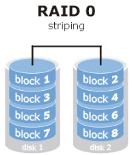
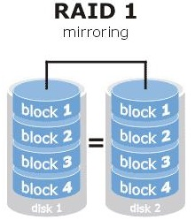
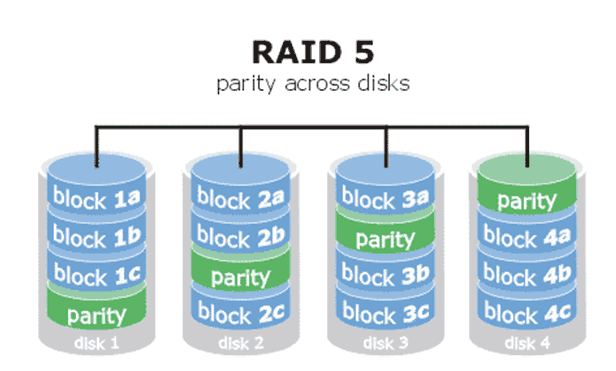
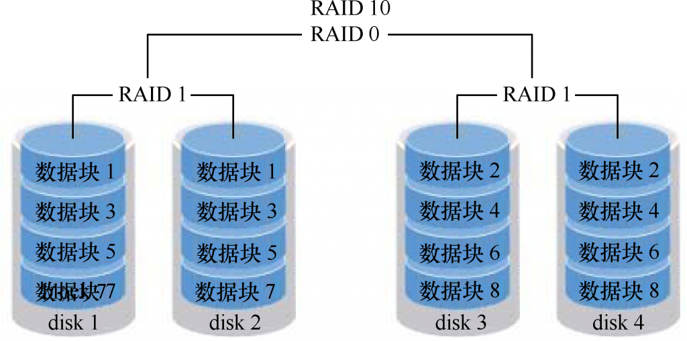

#  ❖ RAID硬盘阵列入门

[参考：Linux就该这么学 第7章 使用RAID与LVM磁盘阵列技术](https://www.linuxprobe.com/chapter-07.html)

## 学习RAID

[参考：RAID 0+1硬盘阵列组建图解及RAID 0+1和1+0的区别](https://blog.csdn.net/trassion/article/details/45503391)

RAID全称为`Redundant Array of Inexpensive Disks`.

既然是Array阵列，那么也就存在这种array的排列方式。一般大家讨论最多的，也是采用哪种排列方式。

常用RAID阵列方式：
- `RAID 0`：即`Data Stripping`阵列。它把数据分布在N块硬盘上，这样**速度就提升了N倍**。但是只要一块硬盘出现错误，那么整个系统将会受到破坏，可靠性仅为单独一块硬盘的1/N。所以一般让N=2，放一些不太重要的临时文件。
- `RAID 1`：即`Data Mirror`阵列。把一样的数据同时存在N块硬盘上，实现多盘备份。**速度不变，但是浪费空间。**
- `RAID 0+1`(推荐)：即`Mirror/Stripe`阵列。至少需要4块硬盘。2块用于RAID 0分布存储，另2块用于RAID 1镜像备份前2块。这样就能速度和安全性兼顾了。
- `RAID 3 & RAID 5`：采用了`校验+存储`两部分，组件价格昂贵，个人用不推荐。

`RAID 0`一开始发明，是为了提高性能和吞吐量的，但是完全没有。。。

`RAID 1`.

`RAID 5`.

`RAID 10`.

## 开始组建RAID阵列

Prerequisite:
- 树莓派
- 2块以上外置硬盘

