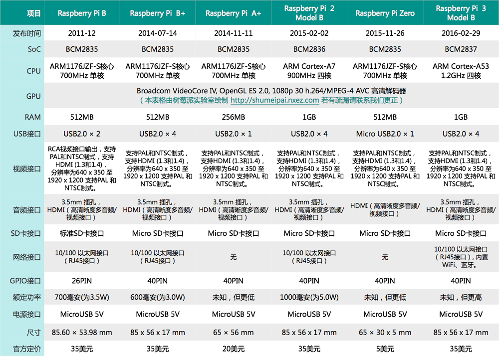
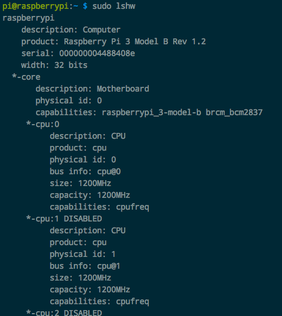

# 树莓派各型号对比



## 怎么查看硬件信息

查看树莓派硬件型号：
```sh
$ cat /sys/firmware/devicetree/base/model
>> Raspberry Pi 3 Model B Rev 1.2

#或
$ cat /proc/device-tree/model
>> Raspberry Pi 3 Model B Rev 1.2
```

查看全部硬件信息：
```sh
$ sudo apt-get install lshw

$ sudo lshw
```



