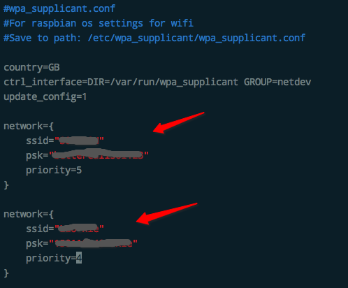
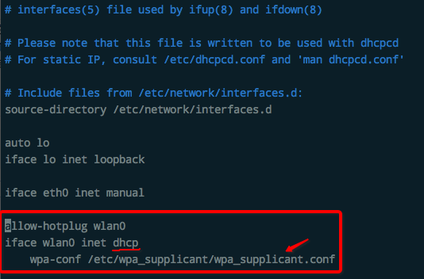

# 树莓派修改Wifi和密码
[参考文章。](https://www.cmgine.com/archives/11053.html)
[参考文章2。](http://imchao.wang/2014/01/02/make-you-raspberrypi-auto-connect-to-wifi/)

简单说，只需要改两个文件即可，甚至改一个文件即可。

抛开Linux系统问题，光树莓派的话，只需要打开`/etc/wpa_supplicant/wpa_supplicant.conf`这个文件编辑，里面会有明文显示wifi的登录名和密码，如果想改的话直接在这里改好保存退出就ok了。如下图：

图中我配置了两个Wifi的登录信息，这样的话，一个连不上可以自动连第二个。
在文中，很明显就可以找到登录名和密码的位置，增删改都不用多说。如果要增加一个WIFI信息，那就把整个`network={...}`复制出来一个改改就好了。

### 更高级设置
一般Linux系统都不是直接改上面那个文件的，实际上WIFI登录密码是直接写在`/etc/network/interfaces`这个文件里的。
但是树莓派默认不会在这个文件直接写wifi信息，而是让它读取额外的一个文件来找到wifi信息。
`interfaces`这个文件内容非常少非常简单，一看就明了，下图是这个文件的全部内容（忽略掉注释内容）：

如图注
