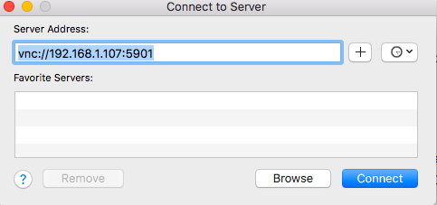
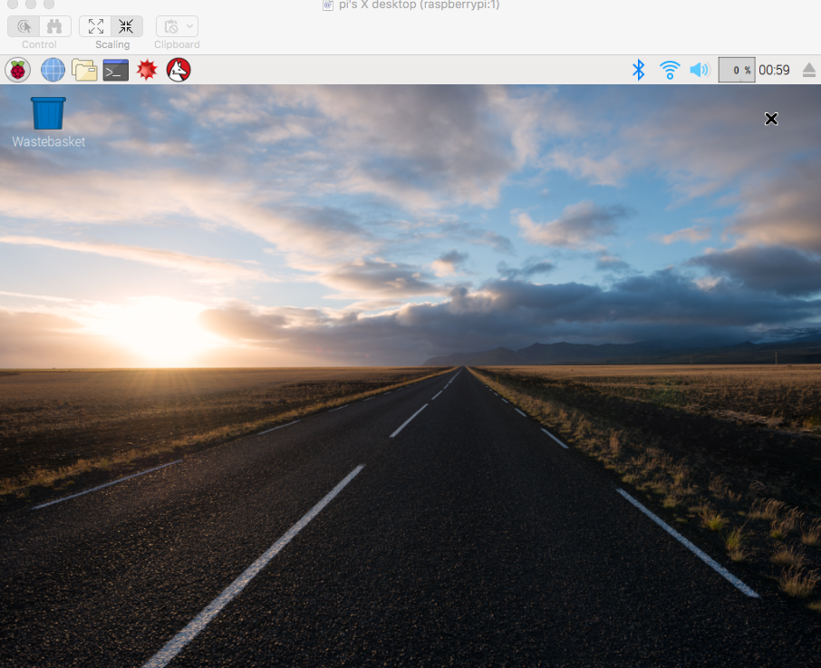

# 通过VNC远程连接树莓派桌面

在已经成功用ssh连接到树莓派到话，如果连接树莓派桌面，需要在树莓派中安装一个叫`tightvncserver`vnc服务。

操作如下：

终端中输入`sudo apt-get install tightvncserver`

安装好后，输入`tightvncserver`回车，启动vnc服务。

然后就可以连接了。

Mac中，在文件夹Finder的菜单中，打开Go下的连接服务器，然后输入`vnc://树莓派IP地址:5901`。其中5901是默认的端口。
Windows上可能需要安装个软件来连接，可以自己查一查。

## VNC中无法连接互联网
通过vnc连接到了树莓派桌面后，无论是浏览器还是桌面中打开的终端，皆无法连接到互联网。
但是SSH连接树莓派时，在命令行里均可以正常连接网络。
那么问题在于vnc了。目前暂没有找到解决方案。
