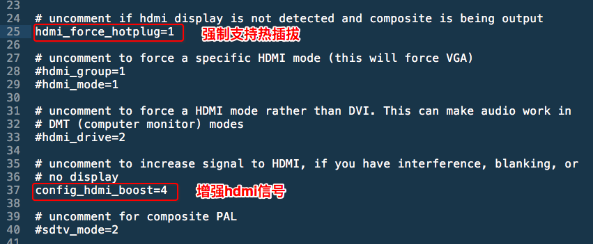

# 树莓派用HDMI连接电视显示"无信号"问题

试了很多次，用HDMI线把树莓派连接电视机，但每次都显示“无信号”。所以搜索了一圈，下面是解决方案。

[参考树莓派官网论坛：HDMI monitors says NO SIGNAL (solved)](https://www.raspberrypi.org/forums/viewtopic.php?t=34061)

> The Pi outputs a relatively weak HDMI signal. Some devices may not immediately notice the Pi's HDMI or may not do the negotiation.
Setting the hdmi_force_hotplug=1 makes sure the Pi believes the monitor/TV is really there.
You might also need to set config_hdmi_boost=4 or even higher (up to 9) if your display needs a stronger signal.
If the display is a computer monitor, use hdmi_group=1 and if it is an older TV, try hdmi_group=2.
Do not set hdmi_safe=1 as that overrides many of the previous options.
Using a shorter or better quality HDMI cable might help.
Make sure your Pi's power supply delivers 1A and not 500mA.
If you see a problem with the red colour - either absent, or interference - then try a boost. However it might simply be that the display requires a stronger signal than the Pi can give.

主要方法是：
- 拔出树莓派的SD卡，然后插到电脑上
- 找到SD卡根目录的`config.txt`文件，打开编辑。
- 找到`#hdmi_force_hotplug=1`这句话，把前面的`#`注释符号去掉，启用HDMI热插拔功能。
- 找到`#config_hdmi_boost=4`这句话，把前面的`#`注释符号去掉，启用加强HDMI信号。

如果还是有问题，那么可以试着这么操作（不推荐）：
- 找到`#hdmi_group=1`这句话，把前面的`#`注释符号去掉，把数字改成`2`，强行指定显示器类型：`1`是连接老式电视，`2`代表连接新电视。

> 用HDMI插上电视后，就连声音都有啦！（不用插音频线，HDMI自带音频传输）
