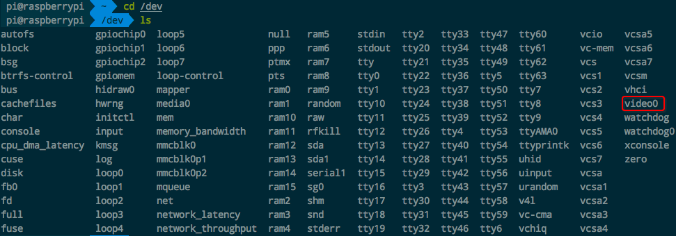
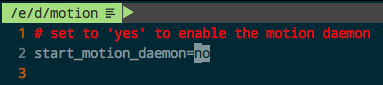
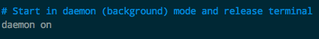
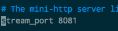
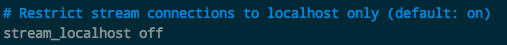
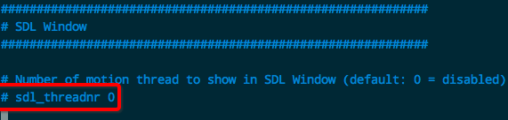
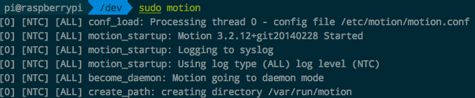
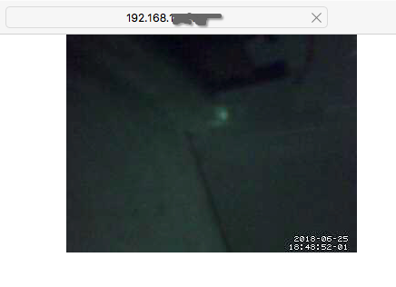
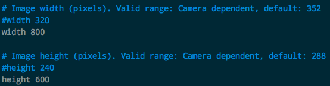
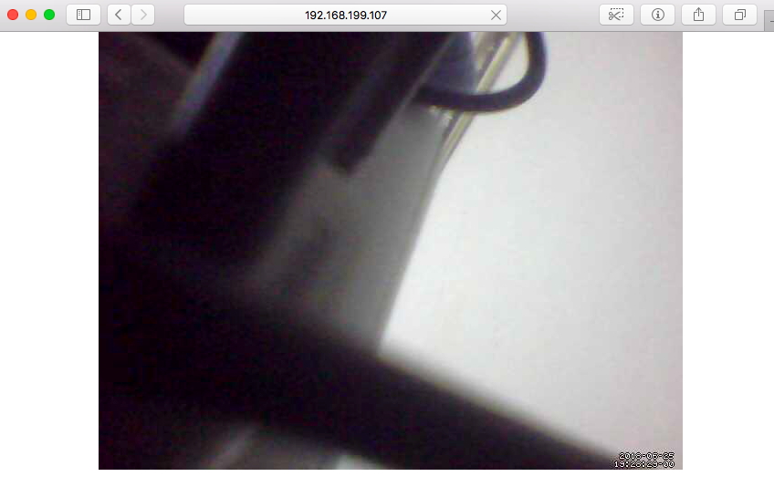

#  ❖ 树莓派连接USB摄像头

手头有一个闲置的USB摄像头，插在自己的笔记本上，能够正常使用，且不用装驱动。
然后想把它插在树莓派上试试。

[参考：树莓派基于motion的usb摄像头监控](https://blog.csdn.net/coolwriter/article/details/75568250)

方法如下：
- 进入树莓派`/dev/`目录，查看有没有`video0`这个文件。

- 安装`motion`程序：
```sh
$ sudo apt-get install motion
```
- 修改`motion`程序的daemon:
```sh
sudo vim /etc/default/motion
```
- 把`no`改成`yes`，开启motion的daemon一直检测设备：

- 打开`motion`程序的配置文件：
```sh
$ sudo vim /etc/motion/motion.conf
```
- 把`daemon off`改成`daemon on`:

- 确认视频流的接口是`8081`：

- 把`stream_localhost on`改成`stream_localhost off`，关闭localhost本地的限制：

- 把`sdl_threadnr`注释屏蔽掉：

- 保存文件，退出。
- 开启`motion`程序的daemon，`sudo motion`:

- 打开浏览器查看树莓派的摄像头影像，地址是：`http://树莓派IP地址:8081`:

然后会看到浏览器一直在刷新显示这个小图像（分辨率不高）▼：



经过测试，只要这个`motion`一直开着，就支持热插拔，随时插上随时都有（需要刷新浏览器）。

关闭`motion`的daemon：
```sh
$ sudo killall -TERM motion
```

## 修改分辨率
默认的显示大小是`320*240`的，非常小，不清楚。所以我们可以把它改大。

还是到`motion`的配置文件里，找到`width`和`height`，改成`800`和`600`，如下：


然后关闭重启`motion`：
```sh
$ sudo killall -TERM motion
$ sudo motion
```

就会看到改大了的显示了：



注意，每次修改如果不显示，或者不成功。可能需要重启下树莓派，或者你的设置比例有问题。

