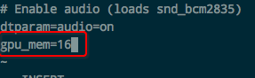
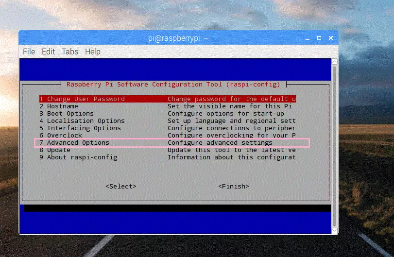

# 树莓派修改GPU显存

树莓派上的内存是分一些给CPU用，分一些给GPU用的。GPU占用的默认是64M。
如果我们不用树莓派的桌面的话，没必要分那么多，可以把它降到最低：16M。
反过来，如果你用树莓派做视频播放、浏览网页，那么就要多分一点：最起码256M或512M。

[参考：增加你的树莓派GPU显存（raspi-config)](https://www.jianshu.com/p/dabcf310395a)


方法一：在SD卡上修改根目录的配置文件`/boot/config.txt`
```
gpu_mem=16
```


方法二：运行`raspi-config`:
Advanced Options -> Memory Split -> 输入GPU占用显存（如16M或512M）



修改后重启就可以了。
