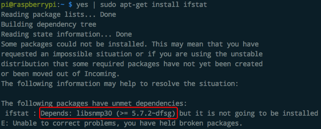
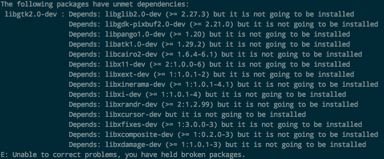

#  ❖ 树莓派各种系统试用 [DRAFT]

## `Raspbian`

[`▶ 树莓派官方资源：所有Distros的历史版本`](http://downloads.raspberrypi.org/)

### `Raspbian Stretch`

包括：
- 2018-06-27-raspbian-stretch
- 2018-06-27-raspbian-stretch-lite

不稳定，速度慢。很多软件安装不了，缺乏依赖。比如最简单的`ifstat`都无法安装：

尝试了很多种方法，都不能解决这些依赖问题。

后面还试了很多常用程序，都是依赖问题无法解决。

放弃。

### `Raspbian Jessie`

包括：
- 2017-07-05-raspbian-jessie

2017版的Jessie是最稳定最好用的版本。
无论是桌面、速度、安装程序等等，都没遇到什么大问题。

主要的限制有：
- Python无法安装到3.4以上版本
- Docker怎么装都装不上

### `Raspbian Jessie 2015-09-28`
这是Jessie面世的第一版。此前是Wheezy。

测试，在Rpi-3b 上无法正常使用，无法自动开启SSH和连接Wifi。

## `Raspbian Lite`

## `Ubuntu Mate`
以下版本都是Ubuntu Mate官网下载的。

### `ubuntu-mate-18.04-desktop-i386`
这个版本连SD卡的boot分区都不给访问，所以不可能达到headless setup。

### `ubuntu-mate-16.04-desktop-armhf-raspberry-pi`
这个版本有一个boot分区给你访问，但是没用。连上屏幕后发现，系统是完全未安装状态的，需要在屏幕上手动一步一步点下一步安装，非常慢，也非常麻烦。而且发现输入了密码也连不上wifi。

问题太多，不值得多花时间去解决问题。

## `其它OS`
还有很多支持或可能支持树莓派的系统，如Pidora(Fedora), Arch Linux ARM, Kali Linux等等。
但是你如果想把它当一个家庭小服务器用，那根本没好用的。
最大安装量贡献量的Raspbian和Ubuntu mate都很多程序不支持，更别说学习成本和出问题网上不好找了。

所以如果不是为了实现特定的项目，没必要安装别的了。
