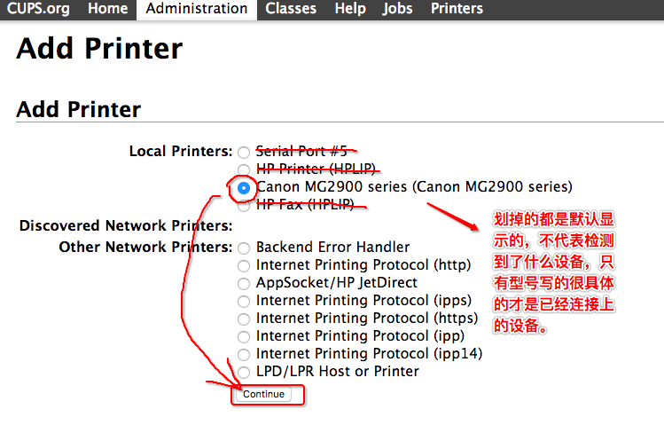
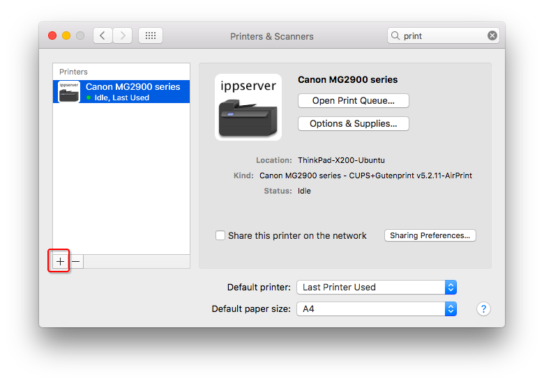
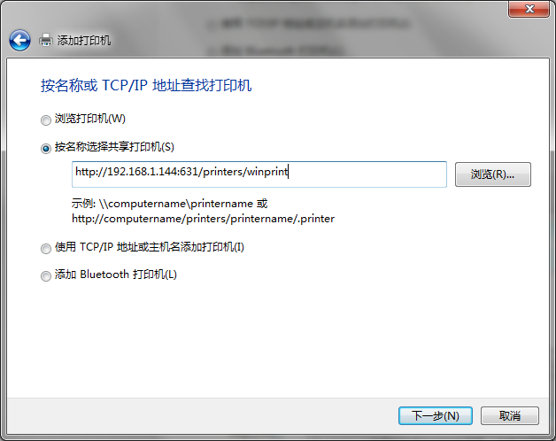

#  ❖ 树莓派添加打印机

打印机主要用的是苹果出的`cups`程序，几乎在所有平台适配所有打印机。

大概步骤：
- 用USB把打印机连接到树莓派上
- 在树莓派安装`cups`，并设置用户权限
- 随便找个网页打开`http://树莓派IP:631`
- 点最上方的Adnimistartor栏，进入管理员设置，用户名密码和树莓派相同
- 点击`add printer`添加打印机
- 如果能检测到打印机连接，这里就会显示正确的型号，不需要手动选一大堆
- 一路下一步，完成添加。
- 在本机Mac或任何设备，在系统设置里添加网络打印机
- 随便找个文档打印

[参考：树莓派搭建网络打印机 扫描仪服务器](http://www.winotmk.com/2017/03/1136)

安装：
```sh
    sudo apt-get install cups -y
    sudo usermod -aG lpadmin $USER
    sudo cupsctl --remote-any
    # Process to this url to manage printers:
    # https://ServerIP:631/
```

安装好后访问地址：`https://ServerIP:631`




## 客户端连接局域网内打印机

Mac上，在系统设置里添加打印机，如果是在局域网内的，这里会直接显示出来打印机，添加即可。


Windows上，控制面板>设备和打印机>添加打印机>无线打印机



IOS上，直接在任何页面，点击Share分享，选择Print打印，就会自动检测局域网内的打印机，然后打印。


IOS上打印PDF等文件，就麻烦一点，因为点share后没有print的选项。
目前下载第三方app的支持都不是很好。几经尝试后发现，唯一的方法是：点击share -> 保存到iCloud -> 打开iCloud -> share -> 打印。这样就不用装第三方软件了，只是步骤多了一些。


## 客户端连接远程打印机

默认打印机只能在局域网共享，很多客户端原生情况下也不支持远程打印机共享。
一般的解决方案是让客户端（手机或电脑）联入打印机所在的VPN，假装成局域网内设备，再打印。


## 问题：树莓派cups版本太低 不支持一些打印机

基于树莓派ARM架构的原因，很多软件都不能一键安装，或者是版本长期不更新。
比如CUPS的现在版本是2.1以上，但是Raspbian上的CUPS版本最高只有1.7。
另外`gutenprint`的版本也是很重要的因素。

基于这几项，都很有必要删除旧版本，然后编译安装新版本。（没有一键安装，当然只能自己编译了）

参考请直接跳到CUPS的Github官网：https://github.com/apple/cups

### ~以下编译不成功，编译很难成功！~

```sh
# 首先卸载本地的旧版本
$ sudo apt-get remove --purge cups

# 安装编译所需依赖
sudo apt-get install autoconf build-essential libavahi-client-dev \
     libgnutls28-dev libkrb5-dev libnss-mdns libpam-dev \
     libsystemd-dev libusb-1.0-0-dev zlib1g-dev -y

# 下载源文件
git clone https://github.com/apple/cups.git

# 自动配置
cd cups
./configure

# 如果没有错误产生，则开始编译
make
```

遇到编译错误：
```
Making all in cups...
Compiling tls.c...
In file included from tls.c:39:0:
tls-gnutls.c: In function ‘httpCredentialsAreValidForName’:
tls-gnutls.c:397:56: error: conversion to ‘int’ from ‘unsigned int’ may change the sign of the result [-Werror=sign-conversion]
           if (!gnutls_x509_crl_get_crt_serial(tls_crl, (unsigned)i, rserial, &rserial_size, NULL) && cserial_size == rserial_size && !memcmp(cserial, rserial, rserial_size))
                                                        ^
In file included from tls.c:39:0:
tls-gnutls.c: In function ‘httpLoadCredentials’:
tls-gnutls.c:784:17: error: conversion to ‘int’ from ‘size_t’ may change the sign of the result [-Werror=sign-conversion]
       decoded = alloc_data - num_data;
                 ^
tls-gnutls.c: In function ‘http_gnutls_load_crl’:
tls-gnutls.c:1027:14: error: conversion to ‘int’ from ‘size_t’ may change the sign of the result [-Werror=sign-conversion]
    decoded = alloc_data - num_data;
              ^
cc1: all warnings being treated as errors
../Makedefs:266: recipe for target 'tls.o' failed
make[1]: *** [tls.o] Error 1
Makefile:180: recipe for target 'install-data' failed
make: *** [install-data] Error 2
```


## 更新：编译安装`gutenprint`

一般都说不用更新`cups`，如果打印机驱动不支持或没有，则安装更新`gutenprint`即可。因为cups本身是没有驱动包的，它是依赖`gutenprint`集成的各个打印机驱动。

首先到`gutenprint`官网下载最新版的打印机驱动源代码：http://gimp-print.sourceforge.net/

找到合适版本点击下载后得到一个tar包，比如`gutenprint-5.2.14.tar.bz2`。
以下以此包来编译安装。

```sh
sudo apt-get install automake autopoint openjade jade sgmltools-lite byacc docbook-utils flex libcups2-dev libcupsimage2-dev libusb-dev

wget https://jaist.dl.sourceforge.net/project/gimp-print/gutenprint-5.2/5.2.14/gutenprint-5.2.14.tar.bz2
tar -xvf gutenprint-5.2.14.tar.bz2
cd gutenprint*

sudo ./configure
sudo make clean
sudo make
sudo make install
```

安装好后，不用重启，直接到cups网页里，add printer添加打印机，就能看到比以前多了很多很多种型号，这时候应该就有你想要的打印机驱动了。


## 更新：printer-driver-splix

```sh
sudo apt-get install printer-driver-splix -y
```

会直接添加很多驱动，还会更新现有驱动。
