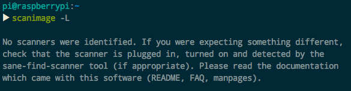

#  ❖ 树莓派添加扫描仪

扫描仪主要用的是`sane`程序，但是不支持网络共享，只是安装驱动让树莓派能使用扫描仪。

扫描仪主要用的`sane`程序。树莓派和Ubuntu系的都是原生自带的，无需安装，命令为`scanimage -L`

以下是基本命令：
```sh
# 如果本机没有，就安装以下
$ sudo apt-get install sane

# 列出当前本机已连接的扫描仪和名称
$ scanimage -L
>> device `pixma:04A91780_13F3F7' is a CANON Canon PIXMA MG2900 Series multi-function peripheral

# 扫描: 按TIFF格式输出为sample.tiff文件
$  scanimage -d "设备名称" –-format=tiff > sample.tiff
```

但是，这只能让USB连接扫描仪的电脑正常使用，现在还不能共享到网络上（实际上共享扫描仪没什么意义，还是要手动把东西放进去扫描）

就算还是要做，那么比较流行的方案是用`Dynamic Web TWAIN`的API，还需要自己写代码生成实例。过程比较复杂。
[参考Github：raspberrypi-document-scanning](https://github.com/dynamsoft-dwt/raspberrypi-document-scanning)

其实一般直接SSH或者VNC远程桌面连到树莓派，在上面打印就行了，没必要真正共享出来。


### 错误：扫描仪无法识别扫描仪

使用`scanimage -L`时候显示错误：
```
[bjnp] create_broadcast_socket: ERROR - bind socket to local address failed - Cannot assign requested address
```

把sane的配置文件`/etc/sane.d/dll.conf`中注释掉没必要的型号，只保留我自己需要的canon后。这个错误消失。

但是还是不能发现扫描仪：


试了试换个机器（不是树莓派而是普通的Ubuntu笔记本），发现完全正常使用！
那么这就是机器的问题了。
检查了下Sane的版本，树莓派的是`1.0.24`，而笔记本的是`1.0.25`。没差多少。

而且在打印机用自身不接住树莓派连接到局域网WIFI时，笔记本的SANE是可以自动检测到局域网内的扫描仪的，但树莓派没有，只会不断报错。


## Canon MG2922打印扫描一体机的网络设置

佳能的打印扫描一体机是有WIFI网络的，但是要设置，就必须必须必须到Windows上通过官方软件把设置写入到机器中才可以，比如把家里、公司里的WIFI用户密码复制到打印机里，这样它就可以自己连接网络运行了。

具体方法是：

到CANON官网，找到自己的型号driver驱动，选择Windows的，最好选full最全的安装。

第一次安装，需要用USB连接电脑，以后就不用了。

安装好后，就会有`Canon IJ Network Tool`这个东西，所有设置都是通过它。

这个设置会遇到`管理员密码`这个东西，一般默认密码都是`canon`。

连接局域网的WIFI，输入用户密码等。
在把网络设置好后，就可以设置打印机默认属性。
在Windows的设置面板里，找到打印机。添加打印机。右键打开首选项，里面会有一系列的管理方法：如保持不关机等。
这些设置都不是针对Windows，而是直接写入到打印机里面的，到时候就算没有USB连接，也可以保持。


## 扫描仪不借助外部自己连接WIFI的情况

在通过USB连接Windows上，使用官方软件写入WIFI设置后，打印机扫描仪一体机就能够`自力更生`了。
也就是说，第一次必须要用Windows电脑把设置写入进去才行，之后无论是Linux、树莓派、还是纯靠自己，都不需要设置了。

那么这种情况下还有很多好处：
- 当Mac直接连接它自己公开的网络接口的话，是可以用它的扫描仪的！
- 而用Linux电脑的CUPS公开的网络接口，只能用打印机。
