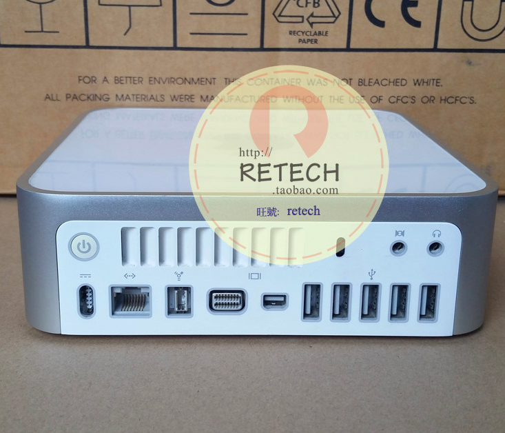
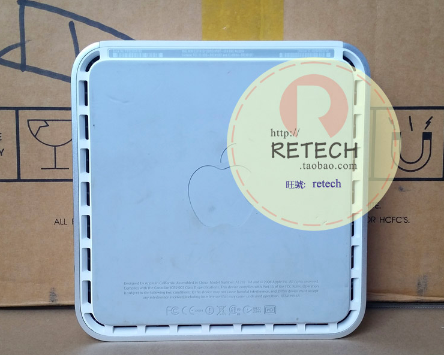

# Mac Mini家庭24小时服务器选购及配置

目前的需求是，想要一台除了树莓派以外另一台基于X86或X64架构的电脑，用来运行Windows或MacOS上的许多软件和应用（比如百度网盘下载、同步等）。

但是单买一台PC机体积太大，迷你PC机又是良莠不齐。所以考虑到了直接买Mac Mini又便宜、构造又好又稳定，还能同时兼容Windows系统。所以是最优选项。实际上很多个人的家庭服务器也都是选用的这个。

由于对性能要求不高，只是需要体积小、能长期稳定不间断运行，所以采用二手Mac Mini。

参考选项：
- [Mac Mini 2nd Generation 2009](https://www.wikiwand.com/en/Mac_Mini#/2nd_generation_(Intel-based))
- Mac Mini 2014

Mac Mini的架构问题：
- T系列CPU：最高只能安装OSX 10.7.5
- P系列CPU：最高能安装OSX OSX 10.11 El Capitan

## Mac Mini  2nd gen 2009 A1283

参数：
- Model：A1283
- CPU
    - P7350：2.0 GHz Intel Core 2 Duo
    - P7550：2.26 GHz or 2.53 GHz (P8700) Intel Core 2 Duo
- Cache：3 MB on-chip L2 cache
- Graphics
    - Nvidia GeForce 9400M using 128 MB or 256 MB of DDR3 SDRAM
    - Nvidia GeForce 9400M using 256 MB of DDR3 SDRAM
- Price Range：RMB 700+

由于Mac Mini早期版本，除了CPU以外其它都可以轻松换，所以以上参数的其它选项都可以不用顾及。

[参考淘宝链接：二手 Mac/苹果 Mac Mini A1283 苹果电脑主机 osX 酋长石10.11](https://item.taobao.com/item.htm?spm=a230r.1.14.1.5a781020dWgi1H&id=540267554815&ns=1&abbucket=8#detail)

## Mac Mini安装Windows+MacOS双系统

Mac Mini 2009最高能兼容的MacOS是OSX 10.11，El Capitan。
