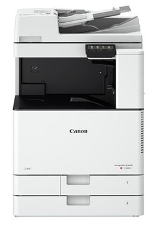
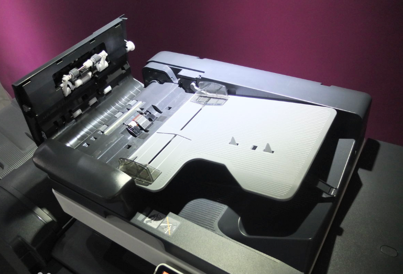
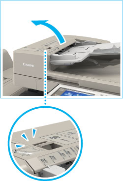

# 打印机专业知识探索

## 输稿器：实现批量自动复印、批量自动扫描

要实现批量复印，即塞一大摞文档进去，它自己自动一页一页复印出来。

这必须要求打印机有`输稿器`(ADT)。输稿器是一个很大的“盖子”盖在整台打印机的表面上。现代商业打印机，几乎每款都有专门配置的ADT。

[参考百科：自动输稿器](https://baike.baidu.com/item/%E8%87%AA%E5%8A%A8%E8%BE%93%E7%A8%BF%E5%99%A8/3357871)

[参考：京东 自动输稿器的功能](https://www.jd.com/phb/zhishi/b6a75d57a094720e.html)

> 基本上现在的复印机大部分已经在出厂标配中含着ADF（自动输稿器）了。即使是那些简装版的机型，标配只有稿台盖板的，同样可以拆掉盖板加装ADF。就连中高端的A4幅面台上式多功能一体机很多都标配了ADF，只有少数便携式复印机是用不了ADF的。
但是如果像是hp的C8500之类的大型激光打印机，注意啊，是打印机，那类的机器是装不了ADF的，因为它没有设计图像读取的功能。

## 喷墨打印

## 连喷

## 循环连喷

## 激光打印

