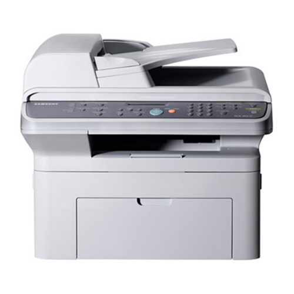

# 树莓派安装Samsung SCX 4521f 打印机驱动

Jessie无法升级cups到最新版本，也就是默认的driver很少，而最新版Raspbian的Stretch则连cups都安装不了。




唯一的成功的解决方案在这里：
Refer to: https://www.raspberrypi.org/forums/viewtopic.php?t=99474

```sh
# Update drivers
$ sudo apt-get install printer-driver-splix
```

或参考：https://github.com/bendlas/splix/blob/master/ppd/scx4521f.ppd
```sh
$ wget https://raw.githubusercontent.com/bendlas/splix/master/ppd/scx4521f.ppd
```

然后就可以在Cups的admin页面正常添加了。


## 更新：printer-driver-splix

```sh
sudo apt-get install printer-driver-splix -y
```

会直接添加很多驱动，还会更新现有的驱动，包括三星等，非常全。


## 更新：ULD

参考：https://raspberrypi.stackexchange.com/questions/27496/samsung-multifunction-printer-with-cups-failing-to-print/38310#38310
参考：https://raspberrypi.stackexchange.com/questions/49422/cups-printer-failing-to-print-out-any-paper

下载好三星ULD驱动包后，解压，按照自己的CPU架构修改脚本，比如我的是`armhf`，然后执行`sudo ./install.sh`

```sh
$ vim uld/noarch/package_utils
```
然后搜索所有带`arm`字眼，把它改为自己的，比如`armhf`，或`armv4`或`armv6`
