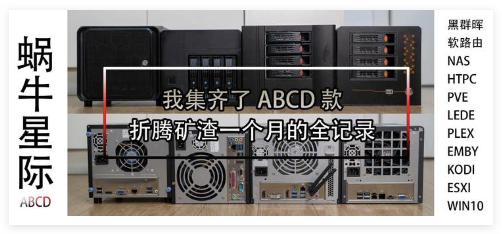
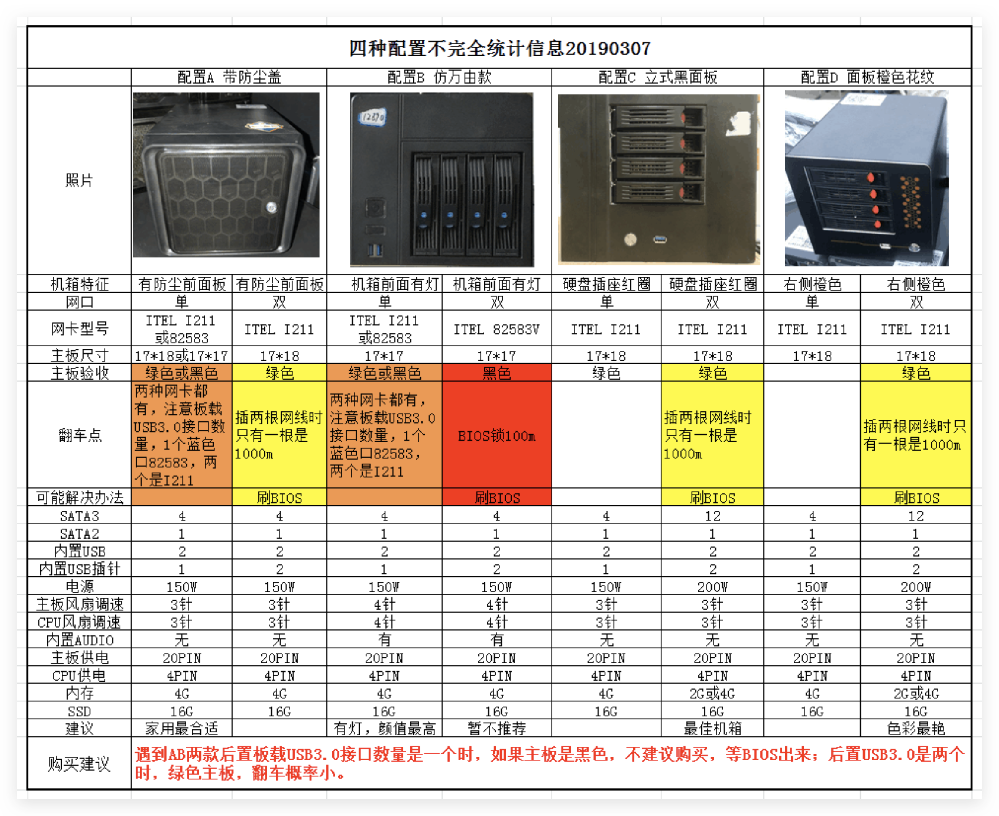
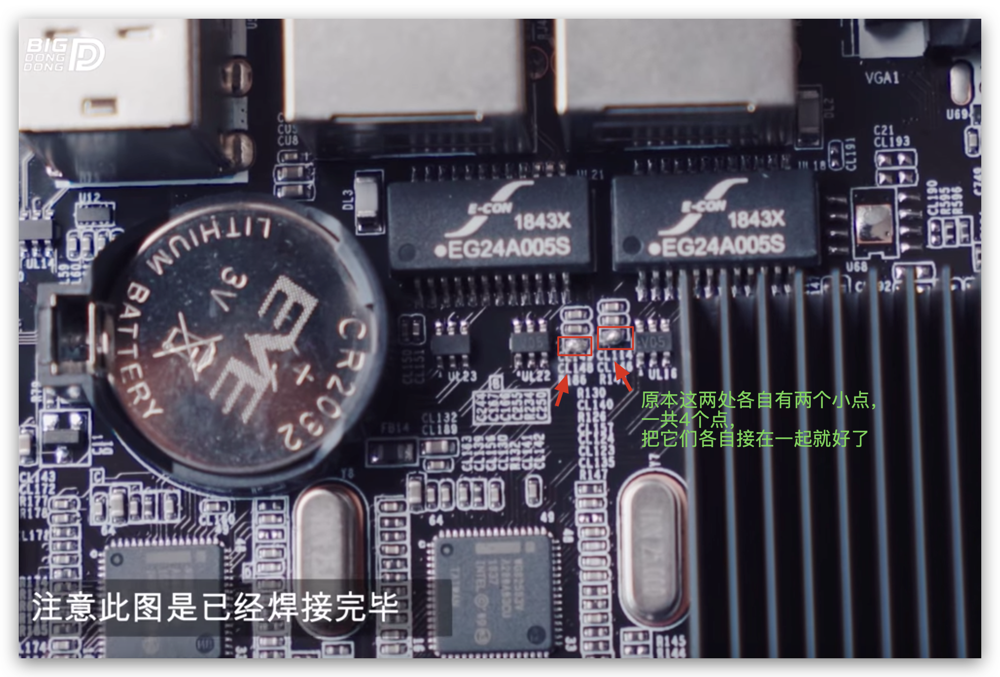
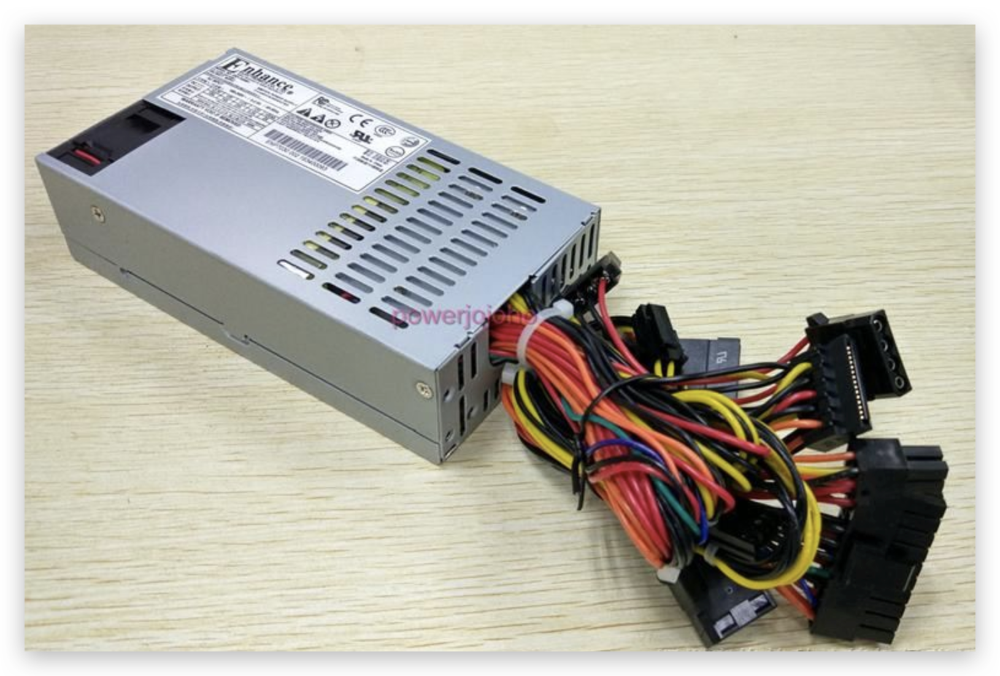
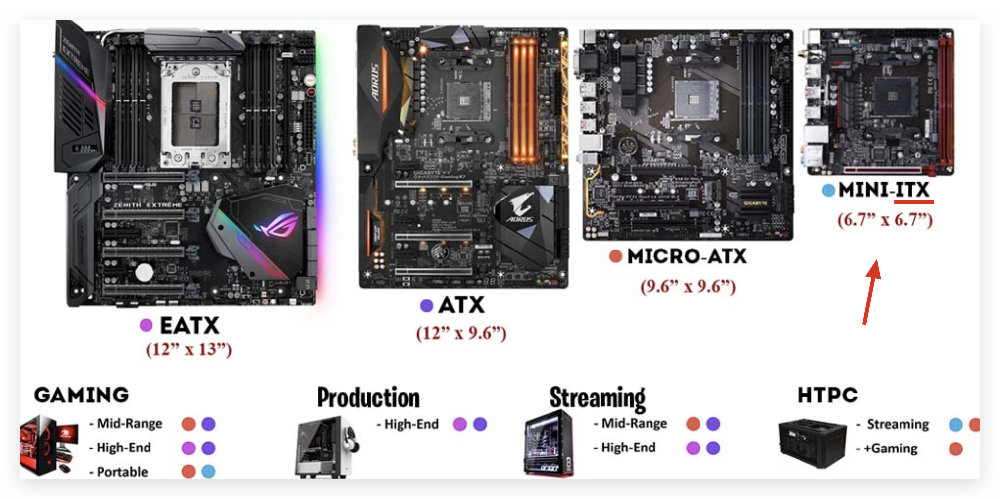

# 300元的黑群晖：星际蜗牛挖矿机(NAS机)

这个机器的背景是：曾经因为比特币挖坑火热，市场上涌现了一大批廉价电脑，专门来24小时不停运行挖矿，俗称挖矿机。
由于这种特殊需求，电脑设计也和一般的DIY电脑不同：
- 不需要显示器因为只是后台跑任务
- 体积小，方便放在角落24小时默默工作
- 电源小，省电
- 硬盘位多

这些廉价挖矿机里最著名的就是一个叫`星际蜗牛`的品牌了。
但是不知怎么，潮流过了很多人没用多久就卖掉了，所以淘宝上能买到大批量的这些机器，而且价格都在300以内。

人们发现这些机器不光可以用来挖矿，还能用来代替昂贵的群晖Synology来作NAS（贵十倍以上），因为有4个盘位，而且设计合理，随便安装什么OS系统，还能安装破解版的“黑群晖”，简直是最佳替代品。

[参考：蜗牛星际：我集齐了ABCD款，折腾矿渣一个月的全记录！ - 什么值得买](https://post.smzdm.com/p/a25r4ddq/)
[参考：300不到的4盘位NAS？蜗牛星际矿难NAS简测](https://www.bilibili.com/read/cv2242663/)
[参考：【BIGDONGDONG】#136 蜗牛星际翻车记丨不到300块的NAS主机 - Youtube](https://www.youtube.com/watch?v=VaXI9ZzXVqg)
[参考：【BIGDONGDONG】#138 史上最值的NAS主机 蜗牛星际矿渣复活记丨LEDE Openwrt&群晖的二合一安装](https://www.youtube.com/watch?v=8fTqx7N7HC4)

## ABCD型号

星际蜗牛的性能配置都是完全一样的：
- CPU: Intel® Celeron® Processor J1900，俗称J1900，是廉价NAS、软路由最常见的CPU
- 内存：4GB
- 硬盘：16G的插卡式SSD，但是比普通优盘还慢

唯一不同的只有机箱设计，分为A/B/C/D四种：

区别如下：

简而言之：
- A型：最轻，最潮，加了一个防尘外壳，但是风扇不是标准12cm而是更小的8cm不好买到。双网口绿色主板的型号支持13个SATA接口。**家用首选**
- B型：外观很好看，完全模仿`万由NAS`
- C型：最重最结实全金属可以当凳子，但是**综合最佳**
- D型：

## 网卡：单网口双网口

每种型号都有`单网口`、`双网口`两种选择。可以根据自己需求选择：
- 作为NAS机，选单网口就够了
- 作为软路由，必须要双网口

可以选择的网卡的型号有：
- Intel i211网卡：单网口的可以直接千兆即速度Gbps，但是双网口的如果同时插两根网线，**只能达到1个百兆一个千兆**，几乎没有破解方法
- Intel 82583网卡：单、双网口的都只能是百兆，但是**能破解（焊接）**，达到两个都是千兆

现代100Mb/s带宽是不能忍的，怎么也要千兆。所以选购方案是：
- 需要单网口的：直接选i211
- 需要双网口的：可以忍的话就i211千兆搭百兆，不能忍的话就自己焊接一下82583（很简单）

### 焊接82583方法

主要有两种方法：
- 自己用细头的焊烙铁直接在主办上把两个点焊接起来
- 买一个很便宜的叫`导电银漆笔`的东西像画画一样直接画一条线就连接上两个点了，几块钱而已

## 1U电源

服务器电源中，因为服务器机架都是有标准宽度的，所以服务器本身宽度也是固定的，服务器电源的宽度也就固定下来了。唯一不同的是厚度，根据需要不同，服务器和服务器电源厚度（高度）也不一样，但是可以用`U`这个"标准服务器厚度"单位来指定，而不是按厘米。
`1U`指的就是一个标准服务器厚度，`2U`就是两个厚度了。

买电源时，只要搜索`1U 电源`，那么型号就不会错了。

买时需要考虑的只有两点：
- 功率：200W的肯定是不够4块硬盘了，所以怎么也要买350W，400W甚至更高的才行
- 静音：400W便宜货一般都会非常吵，不能忍的话只能多花点钱买个好的（400块以上），或者自己清理或改造电源的风扇

1U电源的品牌一般有两个比较常见的选择：
- 台电：便宜好用100元左右（二手），但是很吵
- 益衡：质量好，静音，但是有点贵，400元以上（二手）

## (mini) ITX机箱

机箱的尺寸也是有标准的，但是标准是以`主板尺寸标准`为命名的：而ITX是标准主板中最小的一种。一般用于NAS机。

[参考知乎：ITX主机入坑指南和配置推荐](https://zhuanlan.zhihu.com/p/50859198)

## 主板

推荐绿色的主板，遇到坑的机率小。黑色主板都是搭载82583网卡的，需要自己焊接达到千兆的那个。

A款机箱主板分为三种：
- 单网口绿色主板，网卡是211千兆网卡
- 单网口黑色主板，百兆网卡，但是可以焊接两处位置实现千兆效果
- 双网口绿色主板，两个211千兆芯片，无需焊接。支持13个SATA接口
