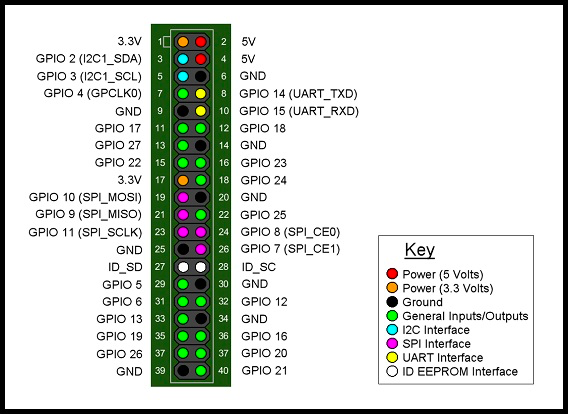
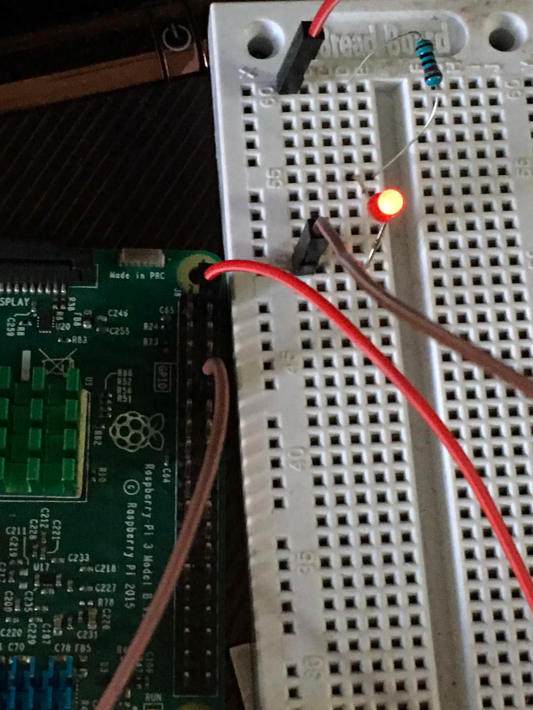

# 树莓派GPIO第一步：点亮LED

参考：https://blog.csdn.net/LeasonQ/article/details/51531311






脚本：
```sh
#!/usr/bin/env python
 
import RPi.GPIO as GPIO
import time
GPIO.setmode(GPIO.BOARD)
GPIO.setup(12,GPIO.OUT)
while True:
 
     GPIO.output(12,True)
 
     time.sleep(1)
     GPIO.output(12,False)
     time.sleep(1)
```
