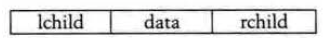

# 二叉树 Binary Tree

二叉树形态：
- 普通二叉树：空二叉树，单节点二叉树，左二叉树，右二叉树，左右二叉树
- 特殊二叉树：
    - 斜二叉树：所有节点都只有左树，或都只有右树。
    - 满二叉树：最完整的二叉树，@1 所有分支节点都有左右树，所有叶子节点都在同一层。
    - 完全二叉树：有“空档”的满二叉树，每个节点的index编号都与`满二叉树`同位置的节点完全相同。

二叉树存储结构：
- 顺序二叉树
- 二叉链表

所有二叉树的存储，实际上都是以List数组存储，因为计算机只能识别线性数据。

二叉链表：

二叉树遍历方法：
- 前序遍历：从上到下，先遍历所有节点的左树，再从上到下，遍历所有节点的右树。
- 中序遍历
- 后序遍历：从下到上，先遍历左树所有叶子节点，逐层往上直到根节点，然后跳到右树底端叶子节点，逐层往上。
