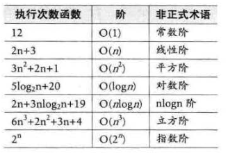
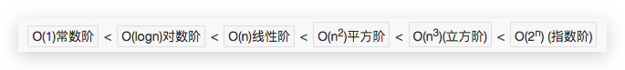
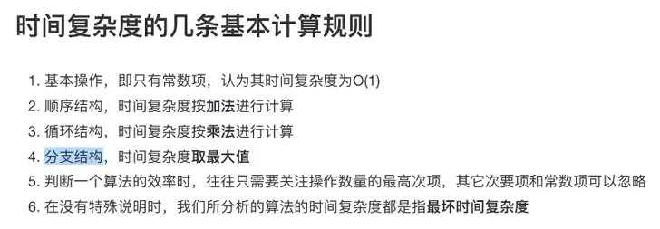

# 算法效率的度量方法

- 事后统计：根据程序运行时间来衡量算法优劣。不科学、不准确，缺点非常多，一般不采用。
- 事前统计：函数曲线、时间复杂度、空间复杂度

## 时间复杂度
> 时间是指`运行时间`。

语句总的执行次数：`T(n)`
`T(n)`是根据规模n给出语句的总执行次数。
一般随着n增大，`T(n)`增长最慢的算法为最优算法。

因为`T(n) = O(f(n))`，所以简单用`O(n)`代表。
而`O(n)`就是`算法时间复杂度函数`，简称BigO函数。

- O(1) 常数阶
- O(n) 线性阶
- O(n²) 平方阶

推导BigO：
- 用常数1取代所有加法常数
- 运行次数函数只保留最高阶
- 如果最高阶不是1，则只保留项本身，不要系数。

例如：
如果算法只需要执行3步，那么`f(n) = 3`，而时间复杂度是`O(1)`，而不是`O(3)`，为什么呢？
因为f(n)的执行次数，实际上不会随着n而变化，而始终是执行1次。所以是`O(1)`

要分析算法的复杂度，主要就是分析**循环**的运行情况。
在一个for loop中，如果运行的语句是简单的一个`O(1)`语句，那么因为要循环运行n次，算法复杂度是`O(n)`。
而如果在for loop中，运行的语句是`c = c*2`,那么`n=2ˣ`，换算过来就是`x=log_2(n)`，那么时间复杂度就是`O(logn)`。

常见时间复杂度：

时间复杂度所耗费时间对比：

对于一个算法，最好的情况是第一项就得到结果，也就是`O(1)`，最坏的情况是要运行到最后一步才得到想要的结果，那么就是`O(n)`。而时间复杂度，一般都是基于最坏情况的。所以也成为最坏时间复杂度。

### 判断时间复杂度

所有程序语言基本控制流程都包含这三个：
- 顺序
- 条件
- 循环

所以看时间复杂度，就要针对这三种流程控制进行分别判断。

## 空间复杂度
> 空间是指`存储空间`。

`S(n) = O(f(n))`，其中`f(n)`是根据n获得占用存储空间的函数。
